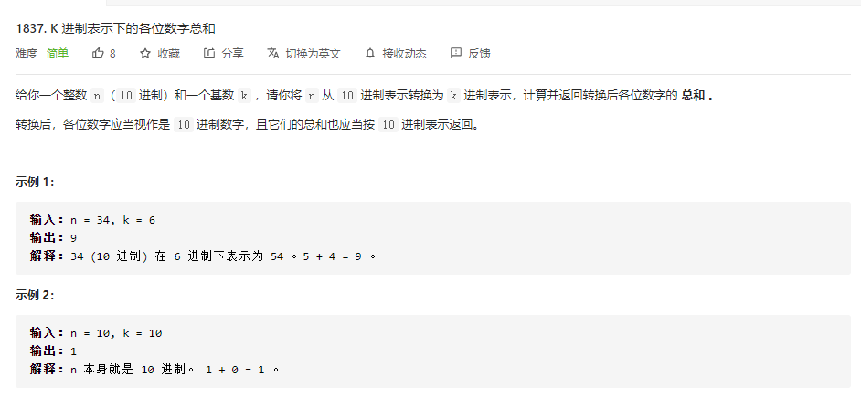
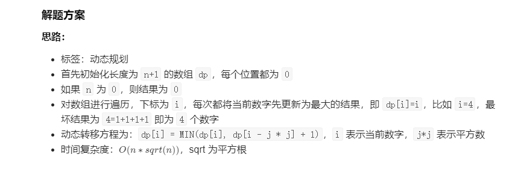

#LeetCode
@(前端面试)[算法]


### **`矩阵对角线元素的和`**


```javascript
/**
 * @param {number[][]} mat
 * @return {number}
 */
var diagonalSum = function (mat) {
    let sum = 0, len = mat.length;
    for (let i = 0; i < len; i++) {
        sum += mat[i][i] + mat[i][len - i - 1];
    }
    if (len & 1) { // 奇数
        let mid = (len / 2) >> 0;
        sum -= mat[mid][mid]
    }
    return sum;
};
```

### **`比赛中的配对次数`**

```javascript
/**
 * @param {number} n
 * @return {number}
 */
var numberOfMatches = function (n) {
    let counter = 0;
    while (n !== 1) {
        if (n & 1) {
            counter += (n - 1) / 2 + 1;
            n = (n - 1) / 2;
        } else {
            counter += n / 2;
            n = n / 2
        }

    }
    return counter;
};
```

### **`K 进制表示下的各位数字总和`**

s
```javascript
/**
 * @param {number} n
 * @param {number} k
 * @return {number}
 */
var sumBase = function (n, k) {
    let sum = 0;
    while (n) {
        sum += n % k;
        n = (n / k) >> 0; // 取整
        // console.log(n)
    }
    return sum;
};
```


### **`最少操作使数组递增`**


```javascript
/**
 * @param {number[]} nums
 * @return {number}
 */
var minOperations = function (nums) {
    let res = 0;
    for (let i = 1, len = nums.length; i < len; i++) {
        let tem = Math.max(nums[i - 1] + 1, nums[i]);
        res += tem - nums[i]
        nums[i] = tem
    }
    return res;
};
```


### **`设计停车系统`**

```javascript
var ParkingSystem = function(big, medium, small) {
    this.park = [0, big, medium, small]
};

ParkingSystem.prototype.addCar = function(carType) {
    if (this.park[carType] > 0 ) {
        this.park[carType] -= 1
        return true
    }
    return false
};


var ParkingSystem = function (big, medium, small) {
    this.carPacks = {
        '1': big,
        '2': medium,
        '3': small
    }
}
ParkingSystem.prototype.addCar = function (carType) {
    if (this.carPacks[carType]) {
        this.carPacks[carType] -= 1
        return true
    } else {
        return false
    }
}
```


### **`哪种连续子字符串更长`**

```javascript
/**
 * @param {string} s
 * @return {boolean}
 */
/**
 * @param {string} s
 * @return {boolean}
 */
var checkZeroOnes = function (s) {
    let num0 = 0
    let num1 = 0
    let count = 0
    let pre = ''
    for (const ch of s) {
        // 当前字符与上个字符相等
        if (ch == pre) {
            count++
        } else {
            // 当前字符与上个字符不相等
            if (pre == '1') {
                num1 = Math.max(count, num1)
            } else if (pre == '0') {
                num0 = Math.max(count, num0)
            }
            count = 1
        }
        pre = ch
    }
    // 当前字符与上个字符不相等
    if (pre == '1') {
        num1 = Math.max(count, num1)
    } else if (pre == '0') {
        num0 = Math.max(count, num0)
    }
    return num1 > num0
}
```

### **`删去字符串中的元音`**

```javascript
/**
 * @param {string} s
 * @return {string}
 */
var removeVowels = function(s) {
  return   s.replace(/[aeiou]/g,'')
};
```


### **`将所有数字用字符替换`**

```javascript
/**
 * @param {string} s
 * @return {string}
 */
var replaceDigits = function (s) {
    let strArr = [...s];
    for (let i = 1, len = s.length; i < len; i += 2) {
        // +strArr[i]转变为数字
        strArr[i] = String.fromCharCode(strArr[i - 1].charCodeAt() + +strArr[i]);
    }
    return strArr.join('')
};
```

### **`统计位数为偶数的数字`**

```javascript
/**
 * @param {number[]} nums
 * @return {number}
 */
var findNumbers = function (nums) {
    let sum = 0;
    nums.forEach(item => {
        (item.toString().length & 1) === 0 ? sum++ : ''
    })
    return sum;
};
```

### **`加一`**

```javascript
/**
 * @param {number[]} digits
 * @return {number[]}
 */
const plusOne = function (digits) {
    // 大整数的加法
    let carry = 0;
    digits[digits.length - 1]++;
    for (let i = digits.length - 1; i >= 0; i--) {
        digits[i] += carry;
        carry = 0;
        if (digits[i] > 9) { // 进位
            carry = (digits[i] / 10) >> 0;
            digits[i] = digits[i] % 10;
        } else {
            break;
        }
    }
    if (carry) {
        digits[0] = digits[0] % 10;
        digits.unshift(1)
    }
    return digits;

    // return (BigInt(digits.join('')) + 1n).toString().split('')
};
```

### **`移动零`**


```javascript
/**
 * @param {number[]} nums
 * @return {void} Do not return anything, modify nums in-place instead.
 */
var moveZeroes = function (nums) {
    let right = 0, left = 0, len = nums.length;
    while (right < len) {
        if (nums[right]) {
            while (left < right) {
                if (nums[left] === 0) {
                    break;
                }
                left++
            }
            [nums[left], nums[right]] = [nums[right], nums[left]]
        }
        right++;
    }
    return nums
};
```

### **`比特位计数`**

```javascript
/*位运算 动态规划
        1.位运算概览
        符号 描述    运算规则
        &    与      两个位都为1时，结果才为1
        |    或      两个位都为0时，结果才为0
        ^    异或    两个位相同为0，相异为1
        ~     取反   0变1，1变0
        左移 << 各二进位全部左移若干位，高位丢弃，低位补0
        */

/*对于任一数 i，它二进制数中 1 的个数 = i 右移一位 的 1 的个数 + i 末位 1 的个数
用 dp[i] 表示 i 对应二进制数中 1 的个数，即 dp[i] = dp[i >> 1] + 末位
举例说明：
对于 7，二进制为 111，右移一位为 11(即3)，末位为 1，即 dp[7] = dp[3] + 1；
对于 8，二进制为 1000，右移一位为 100(即4)，末位为 0，即 dp[8] = dp[4] + 0；
...

又因为奇数末位肯定是 1，偶数末位肯定是 0，所以：
总结：dp[i] = dp[i >> 1] + (i & 1);
判断奇偶用且运算：如果 i 是偶数，i & 1 === 0；如果是奇数，i & 1 === 1；
 */
var countBits = function(num) {
    const dp = Array(num+1).fill(0);
    for(let i = 1 ;i< num+1;i++){
        dp[i] = dp[i>>1] + (i & 1);
    }
    return dp
};
```


### **`买卖股票的最佳时机`**

```javascript
/**
 * @param {number[]} prices
 * @return {number}
 */
var maxProfit = function (prices) {
    // dp[i] = Math.max(dp[i -1],  prices[i] - minPrice)
    let dp = [0], minPrice = prices[0];
    for (let i = 1, len = prices.length; i < len; i++) {
        if (prices[i] < minPrice) {
            minPrice = prices[i];
            // console.log(minPrice)
        }
        dp[i] = Math.max(dp[i - 1], prices[i] - minPrice);
    }
    // console.log(dp)
    return dp[dp.length - 1]
};
```


### **`买卖股票的最佳时机 II`**


```javascript
/**
定义状态 dp[i][0]dp[i][0] 表示第 ii 天交易完后手里没有股票的最大利润，dp[i][1]dp[i][1] 表示第 ii 天交易完后手里持有一支股票的最大利润（ii 从 00 开始）。
 */
var maxProfit = function(prices) {
    const n = prices.length;
    const dp = new Array(n).fill(0).map(v => new Array(2).fill(0));
    dp[0][0] = 0, dp[0][1] = -prices[0];
    for (let i = 1; i < n; ++i) {
        dp[i][0] = Math.max(dp[i - 1][0], dp[i - 1][1] + prices[i]);
        dp[i][1] = Math.max(dp[i - 1][1], dp[i - 1][0] - prices[i]);
    }
    return dp[n - 1][0];
};
```

### **`完全平方数`**

```javascript
/**
 * @param {number[]} nums
 * @return {number}
 */
var findRepeatNumber = function(nums) {
    let map = new Map();
    for(let i of nums){
        if(map.has(i)) return i;
        map.set(i, 1);
    }
    return null;
};
```
### **`找到所有数组中消失的数字`**


```javascript
/**
 * @param {number[]} nums
 * @return {number[]}
 */
var findDisappearedNumbers = function (nums) {
    let len = nums.length;
    // 遍历数组，对应加n
    for (let num of nums) {
        let index = (num - 1) % len;
        nums[index] += len;
    }
    let res = [];
    for (let [index, num] of nums.entries()) {
    
        if (num <= len) {
            res.push(index + 1);
        }
    }
    return res;
};
```
### **`设计哈希集合`**


```javascript
/**
 * Initialize your data structure here.
 */
var MyHashSet = function () {
    this.BASE = 769;
    this.data = new Array(this.BASE).fill(0).map(_ => new Array());
};

/** 
 * @param {number} key
 * @return {void}
 */
MyHashSet.prototype.add = function (key) {
    let hash = this.hash(key), arr = this.data[hash];
    for (const ele of arr) {
        if (ele === key) {
            return;
        }
    }
    arr.push(key);
};

/** 
 * @param {number} key
 * @return {void}
 */
MyHashSet.prototype.remove = function (key) {
    let hash = this.hash(key), arr = this.data[hash];
    for (let i = 0; i < arr.length; i++) {
        if (arr[i] === key) {
            arr.splice(i, 1);
            return;
        }
    }
};

/**
 * Returns true if this set contains the specified element 
 * @param {number} key
 * @return {boolean}
 */
MyHashSet.prototype.contains = function (key) {
    let hash = this.hash(key), arr = this.data[hash];
    for(let ele of arr){
        if(ele === key){
            return true;
        }
    }
    return false;
};

MyHashSet.prototype.hash = function (key) {
    return key && key % this.BASE;
};

/**
 * Your MyHashSet object will be instantiated and called as such:
 * var obj = new MyHashSet()
 * obj.add(key)
 * obj.remove(key)
 * var param_3 = obj.contains(key)
 */
```

### **`设计哈希映射`**


```javascript
var MyHashMap = function () {
    this.BASE = 769;
    this.data = new Array(this.BASE).fill(0).map(() => new Array());
};

MyHashMap.prototype.put = function (key, value) {
    const h = this.hash(key);
    for (const it of this.data[h]) {
        if (it[0] === key) {
            it[1] = value;
            return;
        }
    }
    this.data[h].push([key, value]);
};

MyHashMap.prototype.get = function (key) {
    const h = this.hash(key);
    for (const it of this.data[h]) {
        if (it[0] === key) {
            return it[1];
        }
    }
    return -1;
};

MyHashMap.prototype.remove = function (key) {
    const h = this.hash(key);
    for (const it of this.data[h]) {
        if (it[0] === key) {
            const idx = this.data[h].indexOf(it);
            this.data[h].splice(idx, 1);
            return;
        }
    }
};

MyHashMap.prototype.hash = function (key) {
    return key % this.BASE;
}
```

### **`杨辉三角`**

```
var generate = function(numRows) {
    const ret = [];

    for (let i = 0; i < numRows; i++) {
        const row = new Array(i + 1).fill(1);
        for (let j = 1; j < row.length - 1; j++) {
            row[j] = ret[i - 1][j - 1] + ret[i - 1][j];
        }
        ret.push(row);
    }
    return ret;
};
```
### **`杨辉三角 II`**


```javascript
/**
 * @param {number} rowIndex
 * @return {number[]}
 */
var getRow = function (rowIndex) {
    let pre, cur;
    for (let i = 0; i <= rowIndex; i++) {
        cur = new Array(i + 1).fill(1);
        for (let j = 1; j < i; j++) {
            cur[j] = pre[j - 1] + pre[j];
        }
        pre = cur;
    }
    return cur;
};
```
### **`最后一个单词的长度`**

```javascript
/**
 * @param {string} s
 * @return {number}
 */
var lengthOfLastWord = function(s) {
    let end = s.length - 1;
    while(end >= 0 && s[end] == ' ') end--;
    if(end < 0) return 0;
    let start = end;
    while(start >= 0 && s[start] != ' ') start--;
    return end - start;
};
```
### **`只出现一次的数字`**


```javascript
/**
 * @param {number[]} nums
 * @return {number}
 */
var singleNumber = function (nums) {
    let res = 0;
    for (let num of nums) {
        res = res ^ num
    }
    return res;
};
```

### **`只出现一次的数字 II`**

```javascript
/**
 * @param {number[]} nums
 * @return {number}
 */
var singleNumber = function (nums) {
    // 使用哈希映射统计数组中每个元素的出现次数。
    // 对于哈希映射中的每个键值对，键表示一个元素，值表示其出现的次数。
    let frep = new Map();
    for (let num of nums) {
        frep.set(num, (frep.get(num) || 0) + 1);
    }
    // 遍历map
    for (let [key, val] of frep.entries()) {
        if (val === 1) {
            return key;
        }
    }
};

var singleNumber = function (nums) {
    let ans = 0;
    for (let i = 0; i < 32; ++i) {
        let total = 0;
        // 对每位求和
        for (const num of nums) {
            total += ((num >> i) & 1);
        }
        // 取模后的值就是目标元素的值
        if (total % 3 != 0) {
            ans |= (1 << i); // 左移
        }
    }
    return ans;
};
```
### **`二进制求和`**
```javascript
/**
 * @param {string} a
 * @param {string} b
 * @return {string}
 */
var addBinary = function (a, b) {
    return (BigInt('0b' + a) + BigInt('0b' + b)).toString(2);
};
```


##  **`动态规划`**
### **`完全平方数`**



```javascript
/**
 * @param {number} n
 * @return {number}
 */
var numSquares = function (n) {
    const dp = [...Array(n + 1)].map(_ => 0); // 数组长度为n+1，值均为0
    for (let i = 1; i <= n; i++) {
        dp[i] = i; // 最坏的情况就是每次+1
        for (let j = 1; i - j * j >= 0; j++) {
            dp[i] = Math.min(dp[i], dp[i - j * j] + 1); // 动态转移方程
        }
    }
    return dp[n];
};
```

## **`二分查找`**
### **`在排序数组中查找元素的第一个和最后一个位置`**


```javascript
  /**
   * @param {number[]} nums
   * @param {number} target
   * @return {number[]}
   */

  var searchRange = function (nums, target) {
      const binarySearch = (arr, tar, lower) => {
          let left = 0,
              right = arr.length - 1,
              ans = arr.length; // 目标位置,如果没有比目标数大的数，就直接返回最后一个数
          while (left <= right) {
              let mid = ((right - left) / 2 >> 0) + left
              // 找到第一个比目标数大的数  || 第一个大于等于目标数的数
              if (arr[mid] > tar || (lower && arr[mid] >= tar)) {
                  right = mid - 1;
                  ans = mid;
              } else {
                  left = mid + 1
              }
          }
          return ans;
      };

      let left = binarySearch(nums, target, true)
      let right = binarySearch(nums, target, false) - 1;
      if (left <= right && right <= nums.length - 1) {
          return [left, right]
      } else {
          return [-1, -1]
      }
  };
```

## 树
### **`最小高度树`**


```javascript
/**
 * Definition for a binary tree node.
 * function TreeNode(val) {
 *     this.val = val;
 *     this.left = this.right = null;
 * }
 */
/**
 * @param {number[]} nums
 * @return {TreeNode}
 */
// 二叉搜索树
var sortedArrayToBST = function(nums) {
  if(nums.length === 0 ){
      return null;
  }
  let middle = (nums.length / 2) >> 0;
//   let middle = Math.floor(nums.length / 2);
//   console.log(middle)
  let val = nums[middle];
  let node = new TreeNode(val);
  node.left = sortedArrayToBST(nums.slice(0, middle));
  node.right = sortedArrayToBST(nums.slice(middle + 1));
  return node;
};
```

### **`从前序与中序遍历序列构造二叉树`**


```javascript
/**
 * Definition for a binary tree node.
 * function TreeNode(val, left, right) {
 *     this.val = (val===undefined ? 0 : val)
 *     this.left = (left===undefined ? null : left)
 *     this.right = (right===undefined ? null : right)
 * }
 */
/**
 * @param {number[]} preorder
 * @param {number[]} inorder
 * @return {TreeNode}
 */
var buildTree = function(preorder, inorder) {
    if(!preorder.length) return null
    const node = new TreeNode(preorder[0])
    const index = inorder.indexOf(preorder[0])
    const inLeft = inorder.slice(0, index)
    const inRight = inorder.slice(index + 1)
    const preLeft = preorder.slice(1, index + 1)
    const preRight = preorder.slice(index + 1)
    node.left = buildTree(preLeft, inLeft)
    node.right = buildTree(preRight, inRight)
    return node
};
```
### **`二叉搜索树的最近公共祖先`**


```javascript
/**
 * Definition for a binary tree node.
 * function TreeNode(val) {
 *     this.val = val;
 *     this.left = this.right = null;
 * }
 */
/**
 * @param {TreeNode} root
 * @param {TreeNode} p
 * @param {TreeNode} q
 * @return {TreeNode}
 */
var lowestCommonAncestor = function (root, p, q) {
    if (!root) return null;
    if (root.val > p.val && root.val > q.val) {
        return lowestCommonAncestor(root.left, p, q);
    }
    if (root.val < p.val && root.val < q.val) {
        return lowestCommonAncestor(root.right, p, q);
    }
    return root;
};
```

### **`二叉树的所有路径`**


```javascript
/**
 * Definition for a binary tree node.
 * function TreeNode(val, left, right) {
 *     this.val = (val===undefined ? 0 : val)
 *     this.left = (left===undefined ? null : left)
 *     this.right = (right===undefined ? null : right)
 * }
 */
/**
 * @param {TreeNode} root
 * @return {string[]}
 */
// 深度优先遍历分为先序遍历、中序遍历和后序遍历。
var binaryTreePaths = function(root) {
    const paths = [];
    const construct_paths = (root, path) => {
        if (root) {
            path += root.val.toString();
            if (root.left === null && root.right === null) { // 当前节点是叶子节点
                paths.push(path); // 把路径加入到答案中
            } else {
                path += "->"; // 当前节点不是叶子节点，继续递归遍历
                construct_paths(root.left, path);
                construct_paths(root.right, path);
            }
        }
    }
    construct_paths(root, "");
    return paths;
};
```
### **`二叉树的堂兄弟节点`**


```javascript
/**
 * Definition for a binary tree node.
 * function TreeNode(val, left, right) {
 *     this.val = (val===undefined ? 0 : val)
 *     this.left = (left===undefined ? null : left)
 *     this.right = (right===undefined ? null : right)
 * }
 */
/**
 * @param {TreeNode} root
 * @param {number} x
 * @param {number} y
 * @return {boolean}
 */
var isCousins = function (root, x, y) {
    let xParent = null, xDepth = null, xFound = false;
    let yParent = null, yDepth = null, yFound = false;
    const dfs = (node, depth, parent) => {
        if (!node) {
            return;
        }
        if (node.val === x) {
            [xParent, xDepth, xFound] = [parent, depth, true];
        } else if (node.val === y) {
            [yParent, yDepth, yFound] = [parent, depth, true];
        }
        // 如果两个节点都找到了，就可以提前退出遍历
        if (xFound && yFound) {
            return;
        }
        dfs(node.left, depth + 1, node);
        if (xFound && yFound) {
            return;
        }
        dfs(node.right, depth + 1, node);
    }
    dfs(root, 0, null);
    return xDepth === yDepth && xParent !== yParent;
};
```
### **`平衡二叉树`**


```javascript
var isBalanced = function (root) {
    return balanced(root) !== -1
};
var balanced = function (node) {
    if (!node) return 0
    const left = balanced(node.left)
    const right = balanced(node.right)
    if (left === -1 || right === -1 || Math.abs(left - right) > 1) {
        return -1
    }
    return Math.max(left, right) + 1
}
```
### **`单值二叉树`**

```javascript
/**
 * Definition for a binary tree node.
 * function TreeNode(val, left, right) {
 *     this.val = (val===undefined ? 0 : val)
 *     this.left = (left===undefined ? null : left)
 *     this.right = (right===undefined ? null : right)
 * }
 */
/**
 * @param {TreeNode} root
 * @return {boolean}
 */
var isUnivalTree = function (root) {
    let pre = root.val;
    const dfs = (node) => {
        if (!node) return true;
        if (node.val !== pre) {
            return false
        }
        // 返回
        return dfs(node.left) && dfs(node.right);
    }
    return dfs(root);
};
```

### **`二叉树的层序遍历`**


```javascript
var levelOrder = function(root) {
    const ret = [];
    if (!root) {
        return ret;
    }
    const q = [];
    q.push(root);
    while (q.length !== 0) {
        const currentLevelSize = q.length;
        ret.push([]);
        for (let i = 1; i <= currentLevelSize; ++i) {
            const node = q.shift();
            ret[ret.length - 1].push(node.val);
            if (node.left) q.push(node.left);
            if (node.right) q.push(node.right);
        }
    }     
    return ret;
};


// 
var levelOrder = function(root) {
    if(!root) return []
    const q = [[root, 0]]
    const res = []
    while(q.length) {
        const [n, level] = q.shift()
        if(!res[level]) {
            res.push([n.val])
        } else {
            res[level].push(n.val)
        }
        if(n.left) q.push([n.left, level + 1])
        if(n.right) q.push([n.right, level + 1])
    }
    return res;
};
```
### **`合并二叉树`**


```javascript
/**
 * Definition for a binary tree node.
 * function TreeNode(val, left, right) {
 *     this.val = (val===undefined ? 0 : val)
 *     this.left = (left===undefined ? null : left)
 *     this.right = (right===undefined ? null : right)
 * }
 */
/**
 * @param {TreeNode} root1
 * @param {TreeNode} root2
 * @return {TreeNode}
 */
var mergeTrees = function(root1, root2) {
     if(!root1 || !root2){
         return root1 || root2
     }
     root1.val +=root2.val;
     root1.left  = mergeTrees(root1.left, root2.left)
     root1.right  = mergeTrees(root1.right, root2.right)
     return root1;
};
```


## **`链表`**
### **`相交链表`**


```javascript
/**
 * Definition for singly-linked list.
 * function ListNode(val) {
 *     this.val = val;
 *     this.next = null;
 * }
 */

/**
 * @param {ListNode} headA
 * @param {ListNode} headB
 * @return {ListNode}
 */
var getIntersectionNode = function (headA, headB) {
    let pA = headA, pB = headB;
    while (pA || pB) {
        if(pA === pB) return pA
        pA = pA === null ? headB : pA.next;
        pB = pB === null ? headA : pB.next;
    }
    return null
};
```
### **`回文链表`**

```javascript
/**
 * Definition for singly-linked list.
 * function ListNode(val, next) {
 *     this.val = (val===undefined ? 0 : val)
 *     this.next = (next===undefined ? null : next)
 * }
 */
/**
 * @param {ListNode} head
 * @return {boolean}
 */
var isPalindrome = function (head) {
    const vals = [];
    while (head) {
        vals.push(head.val);
        head = head.next;
    }
    for (let i = 0, j = vals.length - 1; i <= j; i++, j--) {
        if (vals[i] !== vals[j]) {
            return false
        }
    }
    return true;
};
```

### **`剑指 Offer 22. 链表中倒数第k个节点`**

```javascript
/**
 * Definition for singly-linked list.
 * function ListNode(val) {
 *     this.val = val;
 *     this.next = null;
 * }
 */
/**
 * @param {ListNode} head
 * @param {number} k
 * @return {ListNode}
 */
var getKthFromEnd = function (head, k) {
    let quick = head, slow = head, n = 0;;
    while (quick) {
        if (n >= k) {
            slow = slow.next
        }
        quick = quick.next;
        n++;
    }
    return slow;
};
```

### **`链表的中间结点`**


```javascript
/**
 * Definition for singly-linked list.
 * function ListNode(val, next) {
 *     this.val = (val===undefined ? 0 : val)
 *     this.next = (next===undefined ? null : next)
 * }
 */
/**
 * @param {ListNode} head
 * @return {ListNode}
 */
var middleNode = function(head) {
   let fast = head, slow = head;
   while(fast &&fast.next){
       slow = slow.next;
       fast = fast.next.next;
   }     
   return slow
};
```
###  **`删除链表M个节点之后的N个节点`**


```javascript
/**
 * Definition for singly-linked list.
 * function ListNode(val, next) {
 *     this.val = (val===undefined ? 0 : val)
 *     this.next = (next===undefined ? null : next)
 * }
 */
/**
 * @param {ListNode} head
 * @param {number} m
 * @param {number} n
 * @return {ListNode}
 */
var deleteNodes = function (head, m, n) {
    let dummy = new ListNode(0, head);
    let p1 = dummy, p2 = dummy, mCount = m, nCount = n;
    while (p1 && p2) {
        // 保留
        while (mCount-- && p1) {
            p1 = p1.next;
        }
        mCount = m;
        p2 = p1;
        // 删除
        while (nCount-- && p2) {
            p2 = p2.next;
        }
        nCount = n;
        if (!p2) {
            if (p1)
                p1.next = null;
            break;
        }

        p1.next = p2.next; // 改变链表指向
    }
    return dummy.next
};
```
### **`二叉树展开为链表`**


```javascript
/**
 * Definition for a binary tree node.
 * function TreeNode(val, left, right) {
 *     this.val = (val===undefined ? 0 : val)
 *     this.left = (left===undefined ? null : left)
 *     this.right = (right===undefined ? null : right)
 * }
 */
/**
 * @param {TreeNode} root
 * @return {void} Do not return anything, modify root in-place instead.
 */
var flatten = function(root) {
    const list = [];
    preorderTraversal(root, list);
    const size = list.length;
    for (let i = 1; i < size; i++) {
        const prev = list[i - 1], curr = list[i];
        prev.left = null;
        prev.right = curr;
    }
};

const preorderTraversal = (root, list) => {
    if (root != null) {
        list.push(root);
        preorderTraversal(root.left, list);
        preorderTraversal(root.right, list);
    }
}
```

### **`从尾到头打印链表`**

```javascript
/*利用栈先进后出的特性*/
const reversePrint = function (head) {
    let stack = [], res = [];
    let node = head;
    while (node) {
        stack.push(node.val);
        node = node.next;
    }
    while (stack.length) {
        res.push(stack.pop());
    }
    return res;
}
```
```javascript
/**
 * @param {ListNode} head
 * @return {ListNode}
 */
const reverseList = function (head) {
    // 初始化前驱结点为 null
    let pre = null;
    // 初始化目标结点为头结点
    let cur = head;
    // 只要目标结点不为 null，遍历就得继续
    while (cur !== null) {
        // 记录一下 next 结点
        let next = cur.next;
        // 反转指针
        cur.next = pre;
        // pre 往前走一步
        pre = cur;
        // cur往前走一步
        cur = next;
    }
    // 反转结束后，pre 就会变成新链表的头结点
    return pre;
}
var reversePrint = function (head) {
    let res = reverseList(head), resArr = [];
    while (res) {
        resArr.push(res.val);
        res = res.next;
    }
     return resArr;
};
```
### **`剑指 Offer 18. 删除链表的节点`**

```javascript
//dummy 单指针
function deleteNode( head,  val) {
    let dummy = new ListNode(-1,head); 
    let pre = dummy;
    while (pre.next) {
      if (pre.next.val == val) {
        pre.next = pre.next.next;
        return dummy.next;
      }
      pre = pre.next;
    }
    return dummy.next;
}
```
### **`返回倒数第 k 个节点`**

```javascript
/**
 * Definition for singly-linked list.
 * function ListNode(val) {
 *     this.val = val;
 *     this.next = null;
 * }
 */
/**
 * @param {ListNode} head
 * @param {number} k
 * @return {number}
 */
var kthToLast = function (head, k) {
    let slow = head, quick = head;
    while (k--) {
        quick = quick.next;
    }
    while (quick) {
        slow = slow.next;
        quick = quick.next;
    }
    return slow.val;
};
```
### **`面试题 02.01. 移除重复节点`**

```javascript
/**
 * Definition for singly-linked list.
 * function ListNode(val) {
 *     this.val = val;
 *     this.next = null;
 * }
 */
/**
 * @param {ListNode} head
 * @return {ListNode}
 */
var removeDuplicateNodes = function (head) {
    let dummy = new ListNode(-1, head), map = new Map(), node = dummy;
    while (node.next) {
        // 不存在
        if (!map.has(node.next.val)) {
            map.set(node.next.val, node.next.val);
            node = node.next;
        } else {
            node.next = node.next.next;
        }
    }
    return head;
};
```
### **`面试题 02.06. 回文链表`**

```javascript
const reverseList = (head) => {
    let prev = null;
    let curr = head;
    while (curr !== null) {
        let nextTemp = curr.next;
        curr.next = prev;
        prev = curr;
        curr = nextTemp;
    }
    return prev;
}

const endOfFirstHalf = (head) => {
    let dummy = new ListNode(-1, head);
    let fast = dummy;
    let slow = dummy;
    while (fast && fast.next) {
        fast = fast.next.next; /*快指针 走两步 有可能fast为空*/
        slow = slow.next;
    }
    return slow;
}

var isPalindrome = function (head) {
    if (head == null) return true;

    // 找到前半部分链表的尾节点并反转后半部分链表
    const firstHalfEnd = endOfFirstHalf(head);
    const secondHalfStart = reverseList(firstHalfEnd.next);

    // 判断是否回文
    let p1 = head;
    let p2 = secondHalfStart;
    let result = true;
    while (result && p2 != null) {
        if (p1.val != p2.val) result = false;
        p1 = p1.next;
        p2 = p2.next;
    }

    // 还原链表并返回结果
    firstHalfEnd.next = reverseList(secondHalfStart);
    return result;
};
```

### **`反转链表`**


```javascript
/**
 * Definition for singly-linked list.
 * function ListNode(val) {
 *     this.val = val;
 *     this.next = null;
 * }
 */
/**
 * @param {ListNode} head
 * @return {ListNode}
 */
var reverseList = function(head) {
  let pre = null;
  let cur = head;
   while(cur){
     const temp = cur.next;
     cur.next = pre;
     pre = cur;
     cur = temp;
  }
  return pre;
};
```

### **`删除中间节点`**

```javascript
/**
 * Definition for singly-linked list.
 * function ListNode(val) {
 *     this.val = val;
 *     this.next = null;
 * }
 */
/**
 * @param {ListNode} node
 * @return {void} Do not return anything, modify node in-place instead.
 */
var deleteNode = function(node) {
    node.val = node.next.val;
    node.next = node.next.next;
};
```

###**`面试题 17.12. BiNode`**

```javascript
// /**
//  * Definition for a binary tree node.
//  * function TreeNode(val) {
//  *     this.val = val;
//  *     this.left = this.right = null;
//  * }
//  */
// /**
//  * @param {TreeNode} root
//  * @return {TreeNode}
//  */
/**
 * Definition for a binary tree node.
 * function TreeNode(val) {
 *     this.val = val;
 *     this.left = this.right = null;
 * }
 */
/**
 * @param {TreeNode} root
 * @return {TreeNode}
 */
var convertBiNode = function(root) {
    if(!root) return null;
    let preNode = new TreeNode(0);
    //用于存放最后的结果
    let dummyRoot = preNode;
    function dfs(root){
        if(!root) return null;
        //中序遍历 ,左-根-右
        dfs(root.left);
        //将当前结点的左子节点置空
        root.left = null;
        //将上一个结点的由结点指向当前结点
        preNode.right = root;
        //上一个结点下移到当前结点
        preNode  =root;
        dfs(root.right)
    }
    dfs(root);
    return dummyRoot.right;
};
```

## **`栈`**
### **`最长有效括号`**


```javascript
/**
 * @param {string} s
 * @return {number}
 */
var longestValidParentheses = function (s) {
    let maxLength = 0, stack = [-1]; // 保证第一个为
    for (let i = 0, len = s.length; i < len; i++) {
        if (s[i] === '(') {
            stack.push(i);
        } else {
            stack.pop();
            if (stack.length) {
                maxLength = Math.max(maxLength, i - stack[stack.length - 1]);
            } else {
                stack.push(i);
            }
        }
    }
    return maxLength;
};
```
