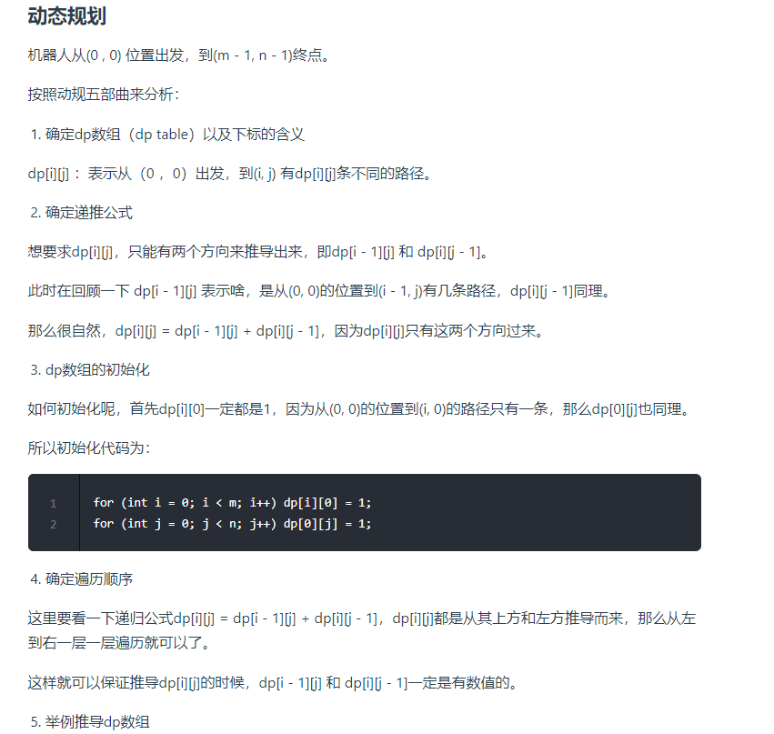
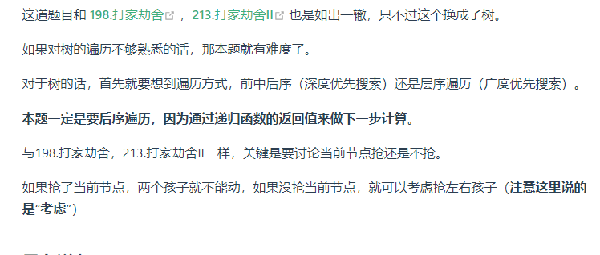

# 算法--动态规划
@(前端面试)[面试]


### 基础问题
#### 斐波那契数


```javascript
var fib = function(n) {
    let dp = [0, 1]
    for(let i = 2; i <= n; i++) {
        dp[i] = dp[i - 1] + dp[i - 2]
    }
   // console.log(dp)
    return dp[n]
};


// 滚动数组
const fib = function (n) {
    let dp = [0, 1];
    if (n <= 1)
        return dp[n]
    for (let i = 2; i <= n; i++) {
        let temp = dp[1]
        dp[1] = dp[1] + dp[0]
        dp[0] = temp
    }
    return dp[1]
}
```


#### 爬楼梯

```javascript
var climbStairs = function (n) {
    // dp[i] 为第 i 阶楼梯有多少种方法爬到楼顶
    // dp[i] = dp[i - 1] + dp[i - 2]
    let dp = [0, 1, 2]
    if(n <=2)   return n
    for (let i = 3; i <= n; i++) {
        let temp = dp[2];
        dp[2] = dp[2] + dp[1]
        dp[1] = temp
    }
    return dp[2]
};
```

#### 使用最小花费爬楼梯

```javascript
const minCostClimbingStairs = cost => {
    const n = cost.length;
    const dp = [0, 0];
    // i从2开始
    for (let i = 2; i <= n; i++) {
        dp[i] = Math.min(dp[i - 1] + cost[i - 1], dp[i - 2] + cost[i - 2]);
    }
    return dp[n];
};

// 滚动数组
/**
 * @param {number[]} cost
 * @return {number}
 */
var minCostClimbingStairs = function (cost) {
    const n = cost.length;
    const dp = [0, 0]
    for (let i = 2; i <= n; i++) {
        let next = Math.min(dp[0] + cost[i - 2], dp[1] + cost[i - 1])
        dp[0] = dp[1]
        dp[1] = next

    }
    return dp[1]
};
```


#### 不同路径



```javascript
/**
 * @param {number} m
 * @param {number} n
 * @return {number}
 */
var uniquePaths = function (m, n) {
    let dp = new Array(m).fill().map(() => new Array(n).fill(1))
    for (let i = 1; i < m; i++)
        for (let j = 1; j < n; j++) {
            dp[i][j] = dp[i - 1][j] + dp[i][j - 1]
        }
    return dp[m - 1][n - 1]
};
```


#### 不同路径 II


```javascript
/**
 * @param {number[][]} obstacleGrid
 * @return {number}
 */
var uniquePathsWithObstacles = function (obstacleGrid) {
    let m = obstacleGrid.length, n = obstacleGrid[0].length;
    let dp = new Array(m).fill().map(() => new Array(n).fill(0))
    // 先进行行遍历
    for (let i = 0; i < m && obstacleGrid[i][0] === 0; i++) {
        dp[i][0] = 1
    }
    // 再进行列遍历
    for (let j = 0; j < n && obstacleGrid[0][j] === 0; j++) {
        dp[0][j] = 1
    }
    for (let i = 1; i < m; i++)
        for (let j = 1; j < n; j++) {
            dp[i][j] = obstacleGrid[i][j] === 1 ? 0 : dp[i - 1][j] + dp[i][j - 1];
        }
    // console.log(dp)
    return dp[m - 1][n - 1]
};
```


#### 整数拆分

```javascript
var integerBreak = function (n) {
    //dp[i]为正整数i拆分之后的最大乘积
    let dp = new Array(n + 1).fill(0);
    dp[2] = 1;
    for (let i = 3; i <= n; i++) {
        for (let j = 1; j < i; j++) {
            //j*(i-j)表示把i拆分为j和i-j两个数相乘
            //j*dp[i-j]表示把i拆分成j和继续把(i-j)这个数拆分，取(i-j)拆分结果中的最大乘积与j相乘
            dp[i] = Math.max(dp[i], dp[i - j] * j, (i - j) * j);
        }
    }
    return dp[n];
};
```


#### 不同的二叉搜索树(BST)

```javascript
/**
 * @param {number} n
 * @return {number}
 */
// 1到i为节点组成的二叉搜索树的个数为dp[i]
const numTrees = (n) => {
    let dp = new Array(n + 1).fill(0);
    dp[0] = 1;
    dp[1] = 1;
    for (let i = 2; i <= n; i++) {
        for (let j = 1; j <= i; j++) {
            dp[i] += dp[j - 1] * dp[i - j];
        }
    }
    return dp[n];
};
```


###  0-1背包问题


```javascript
function testWeightBagProblem(wight, value, size) {
    const len = wight.length,
        dp = Array(size + 1).fill(0);
    // 遍历顺序：先遍历物品, 再遍历背包容量
    for (let i = 0; i < len; i++) { 
        for (let j = size; j >= wight[i]; j--) { // 背包容量倒叙
            dp[j] = Math.max(dp[j], value[i] + dp[j - wight[i]]);
        }
    }
    return dp[size];
}


function test() {
    console.log(testWeightBagProblem([1, 3, 4, 5], [15, 20, 30, 55], 6));
}

test();
```


#### 分割等和子集


```javascript
var canPartition = function (nums) {
    const sum = nums.reduce((p, v) => p + v);
    if (sum & 1) return false;
    let size = sum / 2
    const dp = Array(size + 1).fill(0);
    let weight = value = nums;
    let len = weight.length
    for (let i = 0; i < len; i++) {
        for (let j = size; j >= weight[i]; j--) {
            dp[j] = Math.max(dp[j], value[i] + dp[j - weight[i]])
            if (dp[j] === size) {
                return true;
            }
        }
    }
    return dp[sum / 2] === sum / 2;
};
```

#### 最后一块石头的重量 II

```javascript
/**
 * @param {number[]} stones
 * @return {number}
 */
var lastStoneWeightII = function (stones) {
    let sum = stones.reduce((s, n) => s + n);
    let size = Math.floor(sum / 2);
    let dp = new Array(size + 1).fill(0);
    let weight = value = stones;
    let len = weight.length;
    for (let i = 0; i < len; ++i) {
        for (let j = size; j >= stones[i]; --j) {
            dp[j] = Math.max(dp[j], value[i] + dp[j - weight[i]])
        }
    }

    return sum - dp[size] * 2;
};
```

#### 目标和
 


```javascript
var findTargetSumWays = function (nums, target) {
    const sum = nums.reduce((p, v) => p + v);
    const diff = sum - target;
    if (diff < 0 || diff % 2 !== 0) {
        return 0;
    }
    const size = Math.floor(diff / 2);
    const dp = new Array(size + 1).fill(0);
    let weight = value = nums;
    let len = weight.length;
    dp[0] = 1;
    for (let i = 0; i < len; i++)
        for (let j = size; j >= weight[i]; j--) {
            dp[j] += dp[j - nums[i]];
        }
    return dp[size]

};
```

#### 背包问题总结


----

### 打家劫舍
#### 打家劫舍


```javascript
/**
 * @param {number[]} nums
 * @return {number}
 */
const rob = nums => {
    // 数组长度
    const len = nums.length;
    // dp数组初始化
    const dp = [nums[0], Math.max(nums[0], nums[1])];
    // 从下标2开始遍历
    for (let i = 2; i < len; i++) {
        dp[i] = Math.max(dp[i - 2] + nums[i], dp[i - 1]);
    }
    return dp[len - 1];
};


/**
 * @param {number[]} nums
 * @return {number}
 */
const rob = (nums) => {
    if (!nums.length) return 0
    if(nums.length === 1) return nums[0]
    let first = nums[0], second = Math.max(nums[0], nums[1]);
    for (let i = 2; i < nums.length; i++) {
        const temp = second;
        second = Math.max(first + nums[i], second);
        first = temp;
    }
    return second;
}
```


#### 打家劫舍 II


```javascript
var rob = function (nums) {
    const length = nums.length;
    if (length === 1) {
        return nums[0];
    } else if (length === 2) {
        return Math.max(nums[0], nums[1]);
    }
    return Math.max(robRange(nums, 0, length - 2), robRange(nums, 1, length - 1));
};

const robRange = (nums, start, end) => {
    // 数组长度
    const len = end + 1;
    // dp数组初始化
    const dp = new Array(end - start + 1).fill(0)
    dp[start] = nums[start]
    dp[start + 1] = Math.max(nums[start + 1], nums[start])

    // 从下标2开始遍历
    for (let i = start + 2; i < len; i++) {
        dp[i] = Math.max(dp[i - 2] + nums[i], dp[i - 1]);
    }
    return dp[len - 1];
};
```

#### 打家劫舍 III


```javascript
/**
 * Definition for a binary tree node.
 * function TreeNode(val, left, right) {
 *     this.val = (val===undefined ? 0 : val)
 *     this.left = (left===undefined ? null : left)
 *     this.right = (right===undefined ? null : right)
 * }
 */
/**
 * @param {TreeNode} root
 * @return {number}
 */
const rob = root => {
    // 后序遍历函数
    const postOrder = node => {
        // 递归出口
        if (!node) return [0, 0];
        // 遍历左子树
        const left = postOrder(node.left);
        // 遍历右子树
        const right = postOrder(node.right);
        // 不偷当前节点，左右子节点都可以偷或不偷，取最大值
        const DoNot = Math.max(left[0], left[1]) + Math.max(right[0], right[1]);
        // 偷当前节点，左右子节点只能不偷
        const Do = node.val + left[0] + right[0];
        // [不偷，偷]
        return [DoNot, Do];
    };
    const res = postOrder(root);
    // 返回最大值
    return Math.max(...res);
};
```


---

### 股票问题

#### 买卖股票的最佳时机


```javascript
/**
 * @param {number[]} prices
 * @return {number}
 */
 // dp[i][0] = max(dp[i - 1][0], -prices[i]);
 // dp[i][1] = max(dp[i - 1][1], prices[i] + dp[i - 1][0]);
 // dp[i][0] 表示第i天持有股票所得最多现金
 // dp[i][1] 表示第i天不持有股票所得最多现金
const maxProfit = prices => {
    const len = prices.length;
    // 创建dp数组
    const dp = new Array(len).fill([0, 0]);
    // dp数组初始化
    dp[0] = [-prices[0], 0];
    for (let i = 1; i < len; i++) {
        // 更新dp[i]
        dp[i] = [
            Math.max(dp[i - 1][0], -prices[i]),
            Math.max(dp[i - 1][1], prices[i] + dp[i - 1][0]),
        ];
    }
    return dp[len - 1][1];
};
```


#### 买卖股票的最佳时机 II

```javascript
/**
 * @param {number[]} prices
 * @return {number}
 */
const maxProfit = (prices) => {
    const len = prices.length;
    let dp = Array.from(Array(len), () => Array(2).fill(0));
    // dp[i][0] 表示第i天持有股票所得现金。
    // dp[i][1] 表示第i天不持有股票所得最多现金
    // dp[0][0] = 0 - prices[0];
    // dp[0][1] = 0;
    dp[0] = [-prices[0], 0]
    for (let i = 1; i < len; i++) {
        // 如果第i天持有股票即dp[i][0]， 那么可以由两个状态推出来
        // 第i-1天就持有股票，那么就保持现状，所得现金就是昨天持有股票的所得现金 即：dp[i - 1][0]
        // 第i天买入股票，所得现金就是昨天不持有股票的所得现金减去 今天的股票价格 即：dp[i - 1][1] - prices[i]
        dp[i][0] = Math.max(dp[i - 1][0], dp[i - 1][1] - prices[i]);
        // 在来看看如果第i天不持有股票即dp[i][1]的情况， 依然可以由两个状态推出来
        // 第i-1天就不持有股票，那么就保持现状，所得现金就是昨天不持有股票的所得现金 即：dp[i - 1][1]
        // 第i天卖出股票，所得现金就是按照今天股票佳价格卖出后所得现金即：prices[i] + dp[i - 1][0]
        dp[i][1] = Math.max(dp[i - 1][1], dp[i - 1][0] + prices[i]);
    }
    // console.log(dp)
    return dp[len - 1][1];
}
```


#### 买卖股票的最佳时机含手续费


```javascript
/**
 * @param {number[]} prices
 * @param {number} fee
 * @return {number}
 */
const maxProfit = (prices, fee) => {
    let len = prices.length;
    let dp = Array.from(Array(len), () => Array(2).fill(0));
    dp[0][0] = 0 - prices[0];
    for (let i = 1; i < len; i++) {
        dp[i][0] = Math.max(dp[i - 1][0], dp[i - 1][1] - prices[i]);
        dp[i][1] = Math.max(dp[i - 1][0] + prices[i] - fee, dp[i - 1][1]);
    }
    return Math.max(dp[len - 1][0], dp[len - 1][1]);
}
```


---

### **`子序列问题`**
#### 最长递增子序列


```javascript
/**
 * @param {number[]} nums
 * @return {number}
 */
var lengthOfLIS = function (nums) {
    let dp = new Array(nums.length).fill(1)
    for (let i = 0; i < nums.length; i++) {
        for (let j = 0; j < i; j++) {
            if (nums[i] > nums[j]) {
                dp[i] = Math.max(dp[i], dp[j] + 1) // 不要求lia
            }
        }
    }
    return Math.max(...dp)
}
```


#### 最长连续递增序列


```javascript
/**
 * @param {number[]} nums
 * @return {number}
 */
var findLengthOfLCIS = function (nums) {
    let len = nums.length;
    let dp = new Array(len).fill(1);
    for (let i = 1; i < len; i++) {
        if (nums[i] > nums[i - 1]) {
            dp[i] = dp[i - 1] + 1  // 连续
        }
    }
    return Math.max(...dp)
};
```


#### 最长重复子数组


```javascript
/**
 * @param {number[]} nums1
 * @param {number[]} nums2
 * @return {number}
 */
var findLength = function (nums1, nums2) {
    let [m, n] = [nums1.length, nums2.length]
    let dp = new Array(m + 1).fill(0).map(item => new Array(n + 1).fill(0))
    let res = -Infinity
    for (let i = 1; i < m + 1; i++) {
        for (let j = 1; j < n + 1; j++) {
            if (nums1[i - 1] === nums2[j - 1]) {
                dp[i][j] = dp[i - 1][j - 1] + 1
            }
            res = dp[i][j] > res ? dp[i][j] : res
        }
    }
    return res
}
```

#### 最长公共子序列


```javascript
const longestCommonSubsequence = (text1, text2) => {
    let dp = Array.from(Array(text1.length + 1), () => Array(text2.length + 1).fill(0));
    for (let i = 1; i <= text1.length; i++) {
        for (let j = 1; j <= text2.length; j++) {
            if (text1[i - 1] === text2[j - 1]) {
                dp[i][j] = dp[i - 1][j - 1] + 1;;
            } else {
                dp[i][j] = Math.max(dp[i - 1][j], dp[i][j - 1])
            }
        }
    }
    return dp[text1.length][text2.length];
};
```


#### 不相交的线


```javascript
/**
 * @param {number[]} nums1
 * @param {number[]} nums2
 * @return {number}
 */
var maxUncrossedLines = function (nums1, nums2) {
    let [len1, len2] = [nums1.length, nums2.length]
    let dp = new Array(len1 + 1).fill(0).map(item => new Array(len2 + 1).fill(0))
    for (let i = 1; i < len1 + 1; i++) {
        for (let j = 1; j < len2 + 1; j++) {
            if (nums1[i - 1] === nums2[j - 1]) {
                dp[i][j] = dp[i - 1][j - 1] + 1
            } else {
                dp[i][j] = Math.max(dp[i - 1][j], dp[i][j - 1])
            }
        }
    }
    return dp[len1][len2]
};
```


#### 最大子序和


```javascript
var maxSubArray = function (nums) {
    let dp = new Array(nums.length).fill(nums[0])
    for (let i = 1; i < nums.length; i++) {
        dp[i] = Math.max(dp[i - 1] + nums[i], nums[i])
    }
    // console.log(dp)
    return Math.max(...dp)
}
```


#### 判断子序列


```javascript
const isSubsequence = (s, t) => {
    // s、t的长度
    const [m, n] = [s.length, t.length];
    // dp全初始化为0
    const dp = new Array(m + 1).fill(0).map(x => new Array(n + 1).fill(0));
    for (let i = 1; i <= m; i++) {
        for (let j = 1; j <= n; j++) {
            // 更新dp[i][j]，两种情况
            if (s[i - 1] === t[j - 1]) {
                dp[i][j] = dp[i - 1][j - 1] + 1;
            } else {
                dp[i][j] = dp[i][j - 1];
            }
        }
    }
    // 遍历结束，判断dp右下角的数是否等于s的长度
    return dp[m][n] === m ? true : false;
};
```