# 算法--哈希表
@(前端面试)[面试, 算法]

## 哈希表

首先什么是 哈希表，哈希表（英文名字为Hash table，国内也有一些算法书籍翻译为散列表，大家看到这两个名称知道都是指hash table就可以了）。

> 哈希表是根据关键码的值而直接进行访问的数据结构。

这么这官方的解释可能有点懵，其实直白来讲其实数组就是一张哈希表。

哈希表中关键码就是数组的索引下表，然后通过下表直接访问数组中的元素，如下图所示：


那么哈希表能解决什么问题呢，**一般哈希表都是用来快速判断一个元素是否出现集合里。**

例如要查询一个名字是否在这所学校里。

要枚举的话时间复杂度是O(n)，但如果使用哈希表的话， 只需要O(1) 就可以做到。

我们只需要初始化把这所学校里学生的名字都存在哈希表里，在查询的时候通过索引直接就可以知道这位同学在不在这所学校里了。

将学生姓名映射到哈希表上就涉及到了**hash function ，也就是哈希函数**。

## 哈希函数

哈希函数，把学生的姓名直接映射为哈希表上的索引，然后就可以通过查询索引下表快速知道这位同学是否在这所学校里了。

哈希函数如下图所示，通过hashCode把名字转化为数值，一般hashcode是通过特定编码方式，可以将其他数据格式转化为不同的数值，这样就把学生名字映射为哈希表上的索引数字了。


如果hashCode得到的数值大于 哈希表的大小了，也就是大于tableSize了，怎么办呢？

此时为了保证映射出来的索引数值都落在哈希表上，我们会在再次对数值做一个取模的操作，就要我们就保证了学生姓名一定可以映射到哈希表上了。

此时问题又来了，哈希表我们刚刚说过，就是一个数组。

如果学生的数量大于哈希表的大小怎么办，此时就算哈希函数计算的再均匀，也避免不了会有几位学生的名字同时映射到哈希表 同一个索引下表的位置。

接下来**哈希碰撞**登场

### 哈希碰撞

如图所示，小李和小王都映射到了索引下表 1的位置，**这一现象叫做哈希碰撞**。


一般哈希碰撞有两种解决方法， 拉链法和线性探测法。

### 拉链法

刚刚小李和小王在索引1的位置发生了冲突，发生冲突的元素都被存储在链表中。 这样我们就可以通过索引找到小李和小王了


（数据规模是dataSize， 哈希表的大小为tableSize）

其实拉链法就是要选择适当的哈希表的大小，这样既不会因为数组空值而浪费大量内存，也不会因为链表太长而在查找上浪费太多时间。

### 线性探测法

使用线性探测法，一定要保证tableSize大于dataSize。 我们需要依靠哈希表中的空位来解决碰撞问题。

例如冲突的位置，放了小李，那么就向下找一个空位放置小王的信息。所以要求tableSize一定要大于dataSize ，要不然哈希表上就没有空置的位置来存放 冲突的数据了。如图所示：


其实关于哈希碰撞还有非常多的细节，感兴趣的同学可以再好好研究一下，这里我就不再赘述了。

## 常见的三种哈希结构

当我们想使用哈希法来解决问题的时候，我们一般会选择如下三种数据结构。

* 数组
* set （集合）
* map(映射)

这里数组就没啥可说的了，我们来看一下set。

在C++中，set 和 map 分别提供以下三种数据结构，其底层实现以及优劣如下表所示：

|集合 |底层实现 | 是否有序 |数值是否可以重复 | 能否更改数值|查询效率 |增删效率|
|---|---| --- |---| --- | --- | ---|
|std::set |红黑树 |有序 |否 |否 | O(logn)|O(logn) |
|std::multiset | 红黑树|有序 |是 | 否| O(logn) |O(logn) |
|std::unordered_set |哈希表 |无序 |否 |否 |O(1) | O(1)|

std::unordered_set底层实现为哈希表，std::set 和std::multiset 的底层实现是红黑树，红黑树是一种平衡二叉搜索树，所以key值是有序的，但key不可以修改，改动key值会导致整棵树的错乱，所以只能删除和增加。

|映射 |底层实现 | 是否有序 |数值是否可以重复 | 能否更改数值|查询效率 |增删效率|
|---|---| --- |---| --- | --- | ---|
|std::map |红黑树 |key有序 |key不可重复 |key不可修改 | O(logn)|O(logn) |
|std::multimap | 红黑树|key有序 | key可重复 | key不可修改|O(logn) |O(logn) |
|std::unordered_map |哈希表 | key无序 |key不可重复 |key不可修改 |O(1) | O(1)|

std::unordered_map 底层实现为哈希表，std::map 和std::multimap 的底层实现是红黑树。同理，std::map 和std::multimap 的key也是有序的（这个问题也经常作为面试题，考察对语言容器底层的理解）。

当我们要使用集合来解决哈希问题的时候，优先使用unordered_set，因为它的查询和增删效率是最优的，如果需要集合是有序的，那么就用set，如果要求不仅有序还要有重复数据的话，那么就用multiset。

那么再来看一下map ，在map 是一个key value 的数据结构，map中，对key是有限制，对value没有限制的，因为key的存储方式使用红黑树实现的。

其他语言例如：java里的HashMap ，TreeMap 都是一样的原理。可以灵活贯通。

虽然std::set、std::multiset 的底层实现是红黑树，不是哈希表，但是std::set、std::multiset 依然使用哈希函数来做映射，只不过底层的符号表使用了红黑树来存储数据，所以使用这些数据结构来解决映射问题的方法，我们依然称之为哈希法。 map也是一样的道理。

这里在说一下，一些C++的经典书籍上 例如STL源码剖析，说到了hash_set hash_map，这个与unordered_set，unordered_map又有什么关系呢？

实际上功能都是一样一样的， 但是unordered_set在C++11的时候被引入标准库了，而hash_set并没有，所以建议还是使用unordered_set比较好，这就好比一个是官方认证的，hash_set，hash_map 是C++11标准之前民间高手自发造的轮子。


## 总结
总结一下，**当我们遇到了要快速判断一个元素是否出现集合里的时候，就要考虑哈希法**。
但是哈希法也是**牺牲了空间换取了时间**，因为我们要使用额外的数组，set或者是map来存放数据，才能实现快速的查找。
如果在做面试题目的时候遇到需要判断一个元素是否出现过的场景也应该第一时间想到哈希法！


-----------
### 有效的字母异位词
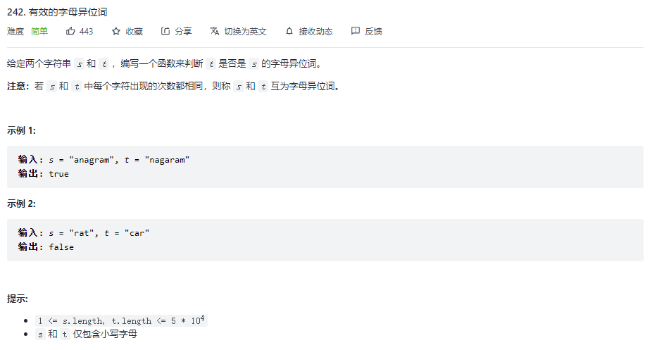
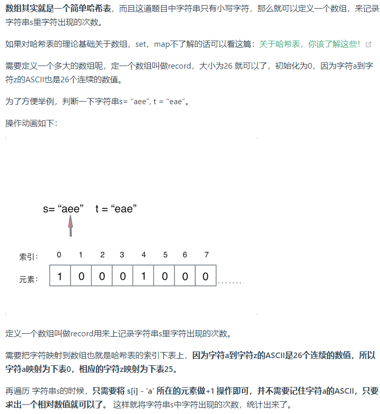
```javascript
/**
 * @param {string} s
 * @param {string} t
 * @return {boolean}
 */
var isAnagram = function (s, t) {
    if (s.length != t.length) return false;
    let hash = new Array(26).fill(0), base = 'a'.charCodeAt();
    for (let i of s) {
        hash[i.charCodeAt() - base]++
    }
    for (let i of t) {
        if (!hash[i.charCodeAt() - base]) return false;
        hash[i.charCodeAt() - base]--;
    }
    return true
};
```


### 两个数组的交集
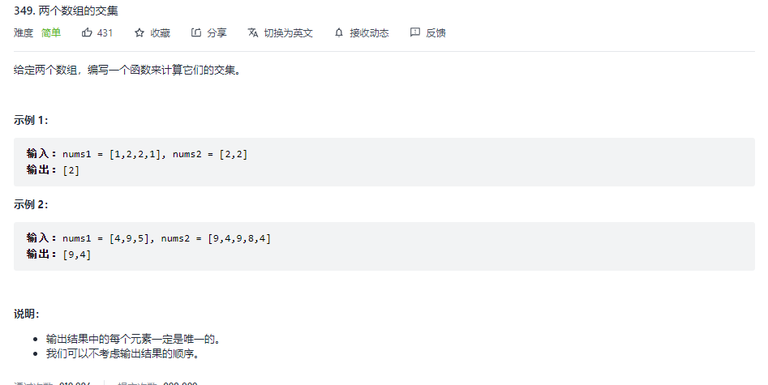
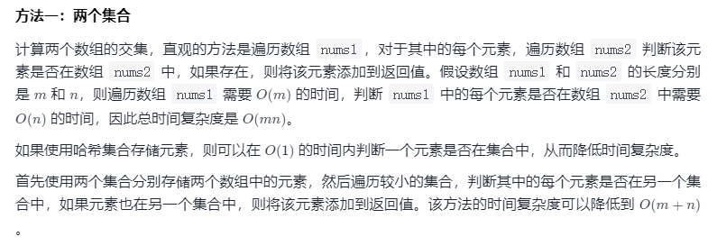

```javascript
/**
 * @param {number[]} nums1
 * @param {number[]} nums2
 * @return {number[]}
 */
var intersection = function (nums1, nums2) {
    let set1 = new Set(nums1), set2 = new Set(nums2);
    let intersct = []
    if (set1.size > set2.size) {
        [set1, set2] = [set2, set1]
    }
    for (let s of set1) {
        set2.has(s) && intersct.push(s)
    }
    return intersct;
};
```


### 快乐数
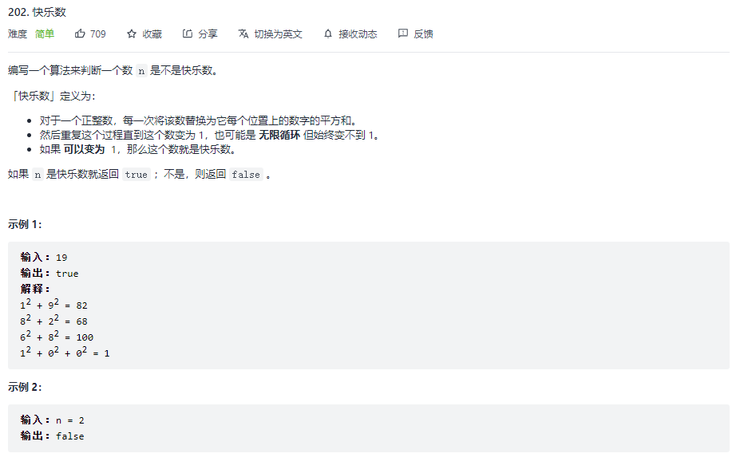
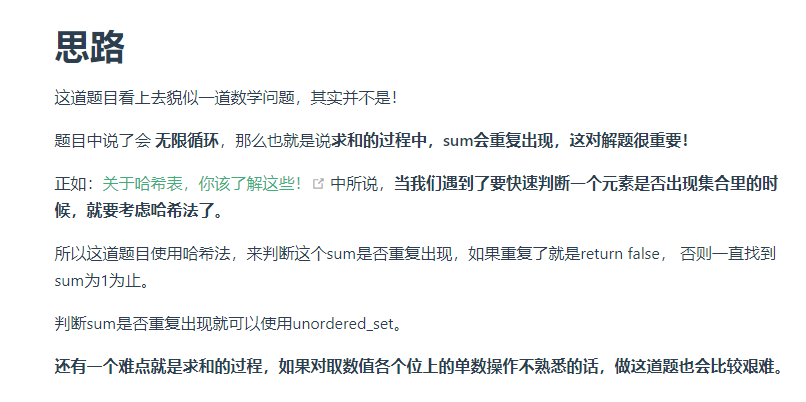
```javascript
/**
 * @param {number} n
 * @return {boolean}
 */
const getNext = (n) => n.toString().split('').map(i => i ** 2).reduce((pre, cur) => pre + cur, 0)
var isHappy = function (n) {
    let set = new Set();
    while (n != 1) {
        n = getNext(n) // n重新赋值
        if (set.has(n)) return false
        set.add(n)
    }
    return true
};
```


### 两数之和
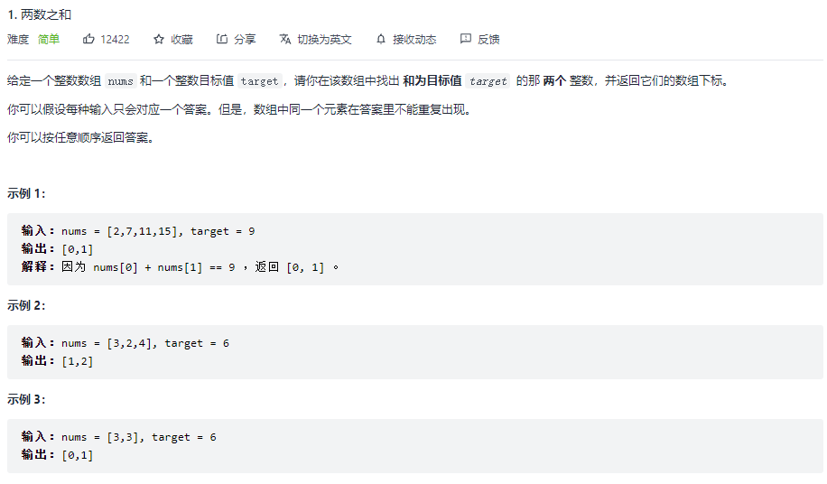
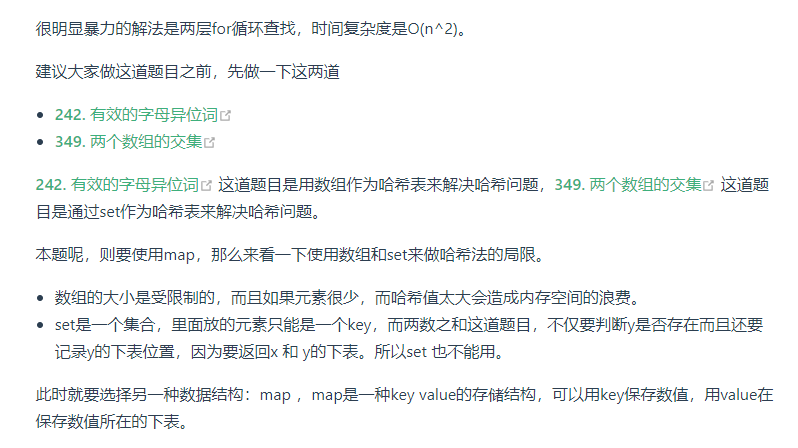
```javascript
/**
 * @param {number[]} nums
 * @param {number} target
 * @return {number[]}
 */
const twoSum = function (nums, target) {
    let map = new Map();
    for (let i = 0; i < nums.length; i++) {
        let another = target - nums[i];
        // console.log(map);
        // console.log(map.get(another));
        if (map.has(another)) {
            // console.log('11');
            // console.log([map.get(another), i]);
            return [map.get(another), i];
        } else {
            map.set(nums[i], i)
        }
    }
}
```


### 四数相加 II
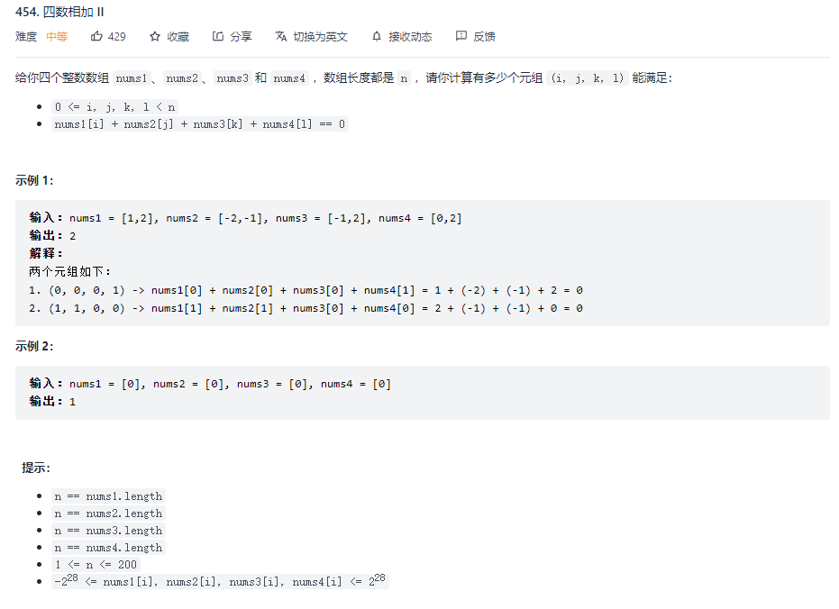
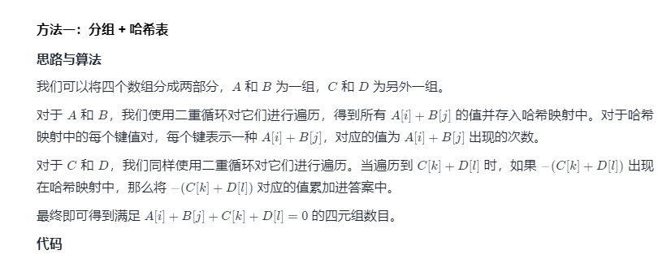

```javascript
/**
 * @param {number[]} nums1
 * @param {number[]} nums2
 * @param {number[]} nums3
 * @param {number[]} nums4
 * @return {number}
 */
var fourSumCount = function (nums1, nums2, nums3, nums4) {
    let twoSumMap = new Map(), count = 0;
    for (let n of nums1)
        for (let m of nums2) {
            let sum = n + m;
            twoSumMap.set(sum, (twoSumMap.get(sum) | 0) + 1)
        }

    for (let n of nums3)
        for (let m of nums4) {
            let sum = n + m;
            count += twoSumMap.get(-sum) | 0
        }
    return count
};
```


### 赎金信
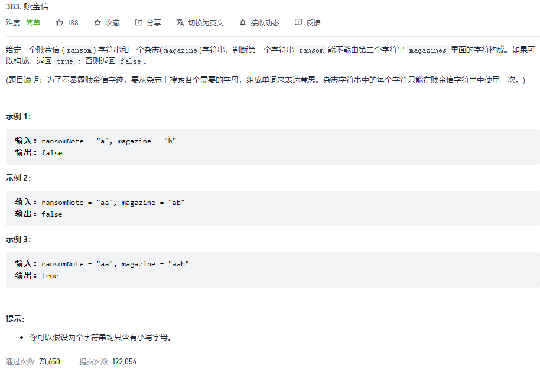
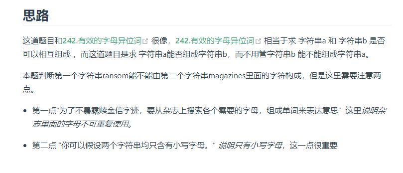
```javascript
/**
 * @param {string} ransomNote
 * @param {string} magazine
 * @return {boolean}
 */
var canConstruct = function (ransomNote, magazine) {
    const strArr = new Array(26).fill(0),
        base = "a".charCodeAt();
    for (const s of magazine) {
        strArr[s.charCodeAt() - base]++;
    }
    for (const s of ransomNote) {
        if (!strArr[s.charCodeAt() - base]) return false;
        strArr[s.charCodeAt() - base]--;
    }
    return true;
};
```


### 三数之和
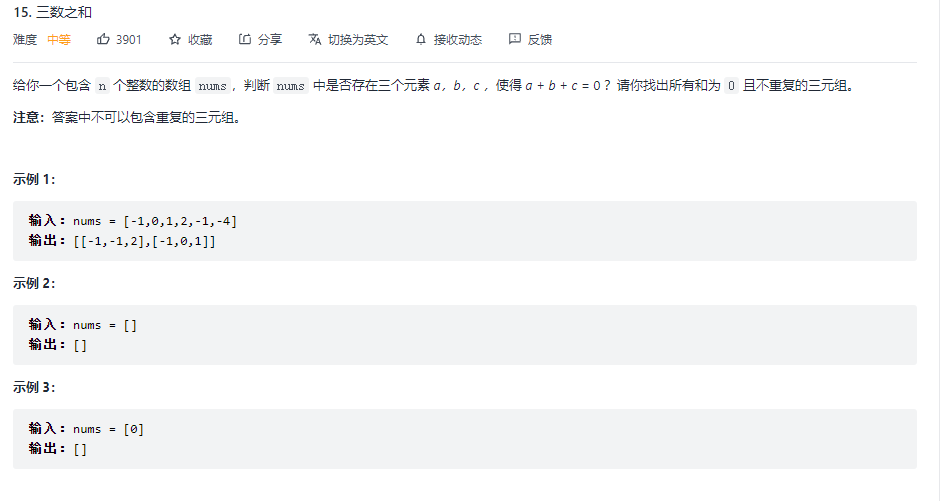

```javascript

/**
 * @param {number[]} nums
 * @return {number[][]}
 */
const threeSum = function (nums) {
  let arr = [];
  const len = nums.length;
  if (nums === null || len < 3) return arr;
  nums = nums.sort((a, b) => a - b); // 排序
  for (let i = 0; i < len; i++) {
    if (nums[i] > 0) break; // 
    if (i > 0 && nums[i] === nums[i - 1]) continue;
    let L = i + 1;
    let R = len - 1;
    while (L < R) {
      const sum = nums[i] + nums[L] + nums[R];
      if (sum === 0) {
        arr.push([nums[i], nums[L], nums[R]]);
        while (L < R && nums[L] === nums[L + 1]) L++;
        while (L < R && nums[R] === nums[R - 1]) R--;
        L++;
        R--;
      } else if (sum < 0) {
        L++
      } else if (sum > 0) {
        R--
      }
    }
  }
  return arr;
};
```


# 哈希表总结

# 哈希表理论基础 
在[关于哈希表，你该了解这些！](https://programmercarl.com/哈希表理论基础.html)中，我们介绍了哈希表的基础理论知识，不同于枯燥的讲解，这里介绍了都是对刷题有帮助的理论知识点。
**一般来说哈希表都是用来快速判断一个元素是否出现集合里**。
对于哈希表，要知道**哈希函数**和**哈希碰撞**在哈希表中的作用.
哈希函数是把传入的key映射到符号表的索引上。
哈希碰撞处理有多个key映射到相同索引上时的情景，处理碰撞的普遍方式是拉链法和线性探测法。
接下来是常见的三种哈希结构：
* 数组
* set（集合）
* map（映射）

在C++语言中，set 和 map 都分别提供了三种数据结构，每种数据结构的底层实现和用途都有所不同，在[关于哈希表，你该了解这些！](https://programmercarl.com/哈希表理论基础.html)中我给出了详细分析，这一知识点很重要！
例如什么时候用std::set，什么时候用std::multiset，什么时候用std::unordered_set，都是很有考究的。
**只有对这些数据结构的底层实现很熟悉，才能灵活使用，否则很容易写出效率低下的程序**。 
# 哈希表经典题目 
## 数组作为哈希表 
一些应用场景就是为数组量身定做的。
在[242.有效的字母异位词](https://programmercarl.com/0242.有效的字母异位词.html)中，我们提到了数组就是简单的哈希表，但是数组的大小是受限的！
这道题目包含小写字母，那么使用数组来做哈希最合适不过。
在[383.赎金信](https://programmercarl.com/0383.赎金信.html)中同样要求只有小写字母，那么就给我们浓浓的暗示，用数组！
本题和[242.有效的字母异位词](https://programmercarl.com/0242.有效的字母异位词.html)很像，[242.有效的字母异位词](https://programmercarl.com/0242.有效的字母异位词.html)是求 字符串a 和 字符串b 是否可以相互组成，在[383.赎金信](https://programmercarl.com/0383.赎金信.html)中是求字符串a能否组成字符串b，而不用管字符串b 能不能组成字符串a。
一些同学可能想，用数组干啥，都用map不就完事了。

**上面两道题目用map确实可以，但使用map的空间消耗要比数组大一些，因为map要维护红黑树或者符号表，而且还要做哈希函数的运算。所以数组更加简单直接有效！** 

## set作为哈希表
在[349. 两个数组的交集](https://programmercarl.com/0349.两个数组的交集.html)中我们给出了什么时候用数组就不行了，需要用set。
这道题目没有限制数值的大小，就无法使用数组来做哈希表了。
**主要因为如下两点：**
* 数组的大小是有限的，受到系统栈空间（不是数据结构的栈）的限制。
* 如果数组空间够大，但哈希值比较少、特别分散、跨度非常大，使用数组就造成空间的极大浪费。
所以此时一样的做映射的话，就可以使用set了。
关于set，C++ 给提供了如下三种可用的数据结构：（详情请看[关于哈希表，你该了解这些！](https://programmercarl.com/哈希表理论基础.html)）
* std::set
* std::multiset
* std::unordered_set
std::set和std::multiset底层实现都是红黑树，std::unordered_set的底层实现是哈希， 使用unordered_set 读写效率是最高的，本题并不需要对数据进行排序，而且还不要让数据重复，所以选择unordered_set。

在[202.快乐数](https://programmercarl.com/0202.快乐数.html)中，我们再次使用了unordered_set来判断一个数是否重复出现过。
## map作为哈希表
在[1.两数之和](https://programmercarl.com/0001.两数之和.html)中map正式登场。
来说一说：使用数组和set来做哈希法的局限。
* 数组的大小是受限制的，而且如果元素很少，而哈希值太大会造成内存空间的浪费。
* set是一个集合，里面放的元素只能是一个key，而两数之和这道题目，不仅要判断y是否存在而且还要记录y的下标位置，因为要返回x 和 y的下标。所以set 也不能用。
map是一种`<key, value>`的结构，本题可以用key保存数值，用value在保存数值所在的下表。所以使用map最为合适。
C++提供如下三种map：：（详情请看[关于哈希表，你该了解这些！](https://programmercarl.com/哈希表理论基础.html)）
* std::map
* std::multimap
* std::unordered_map 
std::unordered_map 底层实现为哈希，std::map 和std::multimap 的底层实现是红黑树。

同理，std::map 和std::multimap 的key也是有序的（这个问题也经常作为面试题，考察对语言容器底层的理解），[1.两数之和](https://programmercarl.com/0001.两数之和.html)中并不需要key有序，选择std::unordered_map 效率更高！
在[454.四数相加](https://programmercarl.com/0454.四数相加II.html)中我们提到了其实需要哈希的地方都能找到map的身影。
本题咋眼一看好像和[18. 四数之和](https://programmercarl.com/0018.四数之和.html)，[15.三数之和](https://programmercarl.com/0015.三数之和.html)差不多，其实差很多！
**关键差别是本题为四个独立的数组，只要找到A[i] + B[j] + C[k] + D[l] = 0就可以，不用考虑重复问题，而[18. 四数之和](https://programmercarl.com/0018.四数之和.html)，[15.三数之和](https://programmercarl.com/0015.三数之和.html)是一个数组（集合）里找到和为0的组合，可就难很多了！**
用哈希法解决了两数之和，很多同学会感觉用哈希法也可以解决三数之和，四数之和。
其实是可以解决，但是非常麻烦，需要去重导致代码效率很低。
在[15.三数之和](https://programmercarl.com/0015.三数之和.html)中我给出了哈希法和双指针两个解法，大家就可以体会到，使用哈希法还是比较麻烦的。
所以18. 四数之和，15.三数之和都推荐使用双指针法！
# 总结
对于哈希表的知识相信很多同学都知道，但是没有成体系。
本篇我们从哈希表的理论基础到数组、set和map的经典应用，把哈希表的整个全貌完整的呈现给大家。
**同时也强调虽然map是万能的，详细介绍了什么时候用数组，什么时候用set**。
相信通过这个总结篇，大家可以对哈希表有一个全面的了解。
