# 算法--回溯法
@(前端面试)[面试]
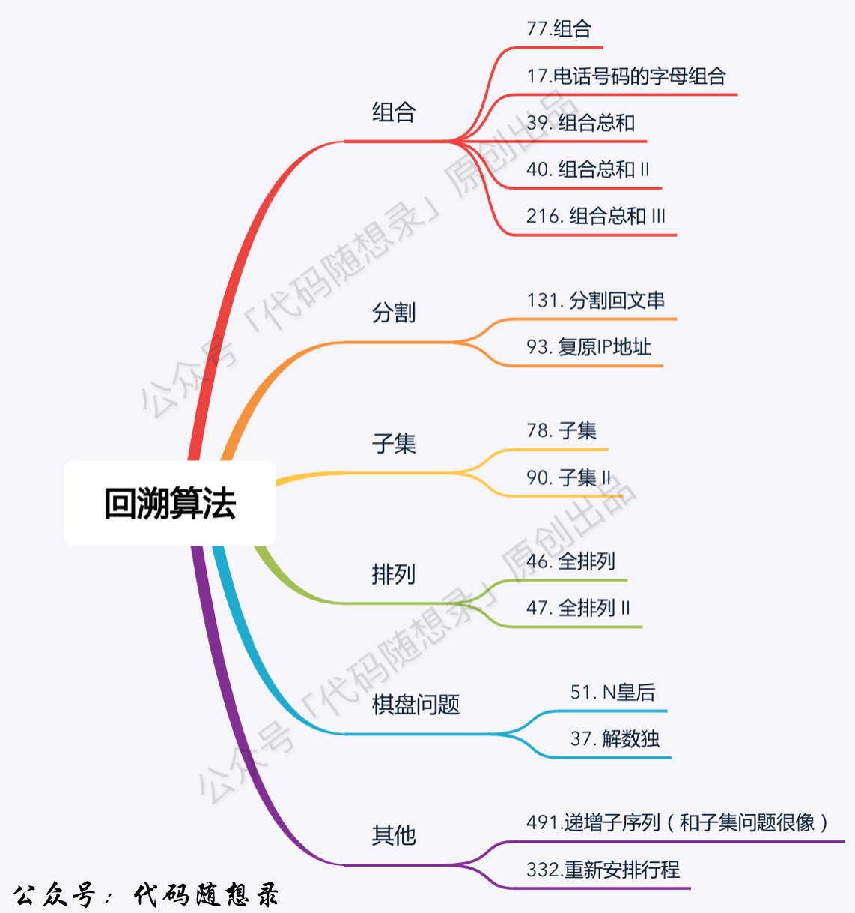
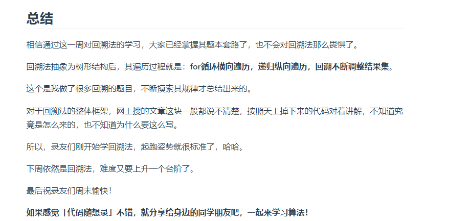
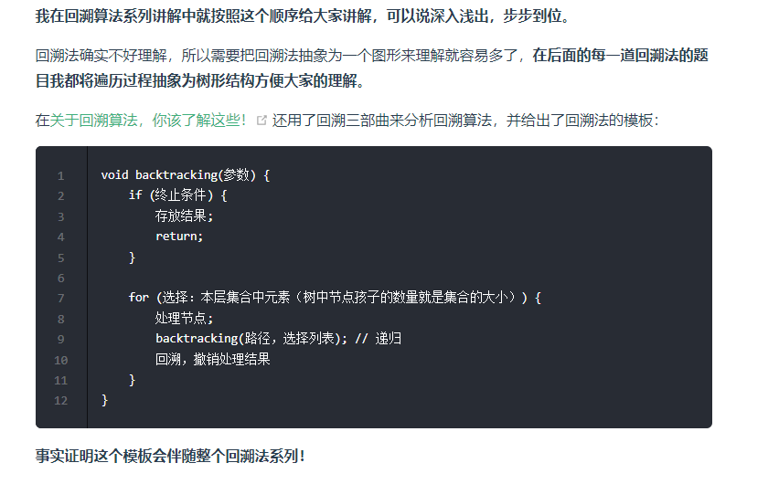


### 组合
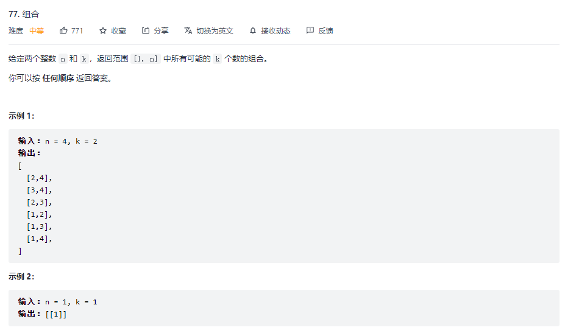
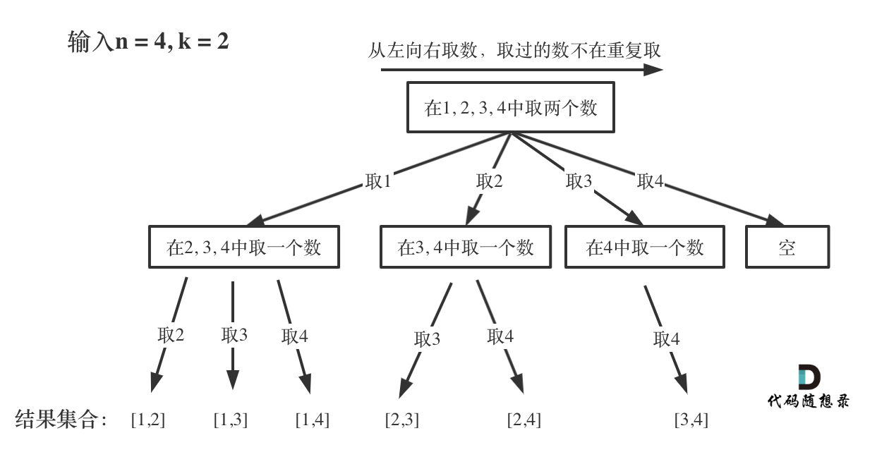
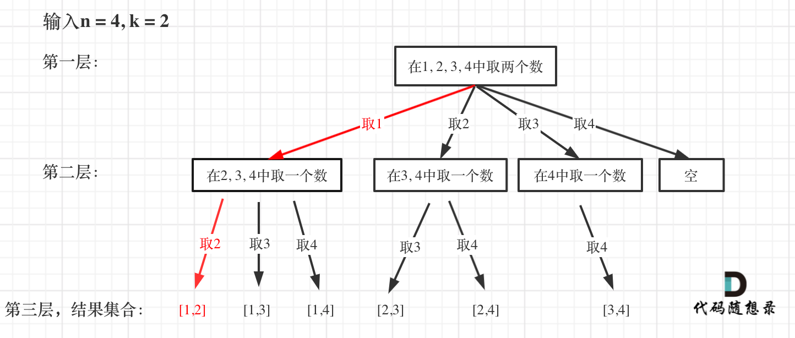
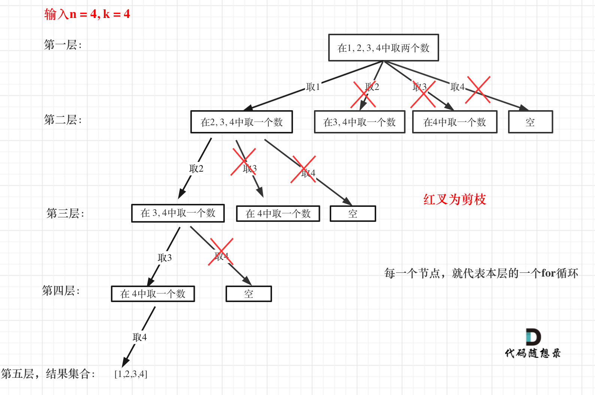

```javascript
let result = []
let path = []
var combine = function(n, k) {
  result = []
  combineHelper(n, k, 1)
  return result
};
const combineHelper = (n, k, startIndex) => {
  if (path.length === k) {
    result.push([...path])
    return
  }
  // 减枝
  for (let i = startIndex; i <= n - (k - path.length) + 1; ++i) {
    path.push(i)
    combineHelper(n, k, i + 1)
    path.pop()
  }
}
```


### 组合总和 III
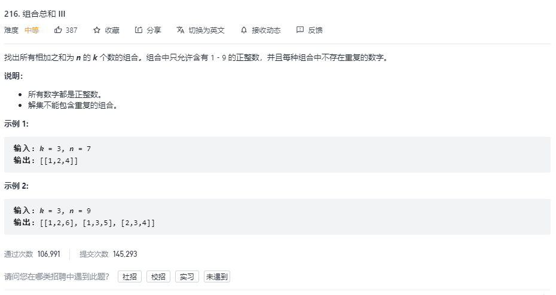
```javascript
/**
 * @param {number} k
 * @param {number} n
 * @return {number[][]}
 */
var combinationSum3 = function (a, b) {
    let k = a, sum = b, n = 9;
    const res = [], path = [];
    backtracking(n, k, 1);
    return res;
    function backtracking(n, k, startIndex) {
        const len = path.length;
        if (len === k) {
            if (path.reduce((previous, value) => previous + value, 0) === sum) {
                res.push(Array.from(path));
            }
            return;
        }
        for (let i = startIndex; i <= n - (k - path.length) + 1; i++) {
            path.push(i);
            backtracking(n, k, i + 1);
            path.pop();
        }
    }
};
```

### 电话号码的字母组合
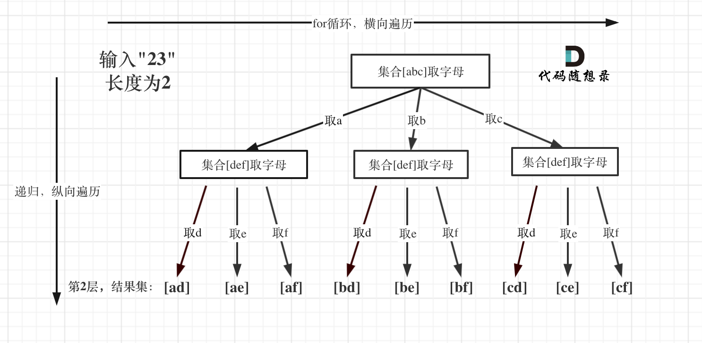
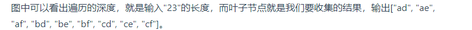
```javascript
/**
 * @param {string} digits
 * @return {string[]}
 */
var letterCombinations = function (digits) {
    const k = digits.length;
    const map = ["", "", "abc", "def", "ghi", "jkl", "mno", "pqrs", "tuv", "wxyz"];
    if (!k) return [];
    if (k === 1) return map[digits].split("");

    const res = [], path = [];
    backtracking(digits, k, 0);
    return res;

    function backtracking(n, k, index) {
        if (path.length === k) { // 达到叶子
            res.push(path.join(""));
            return;
        }
        for (const v of map[n[index]]) {
            path.push(v);
            backtracking(n, k, index + 1);
            path.pop();
        }
    }
};
```


### 组合总和
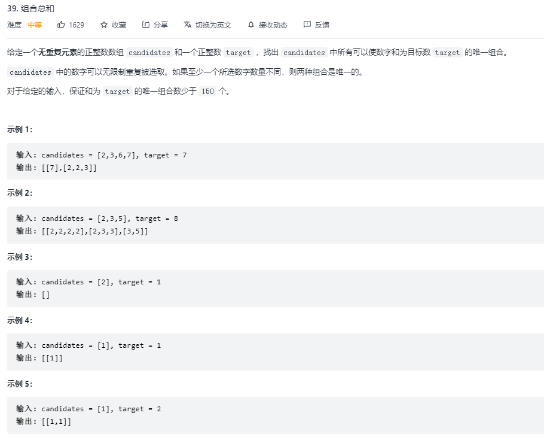
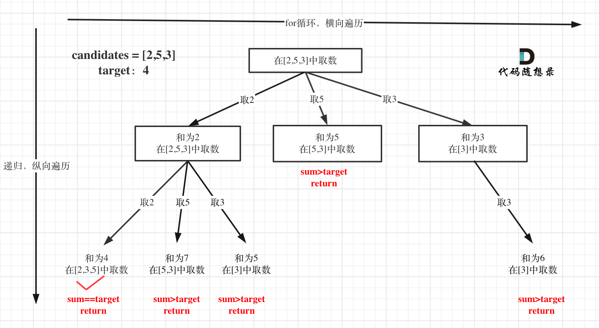
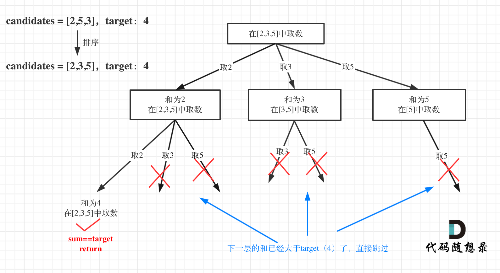
```javascript
/**
 * @param {number[]} candidates
 * @param {number} target
 * @return {number[][]}
 */
var combinationSum2 = function (candidates, target) {
    const backtracking = (startIndex) => {
        if (sum > target) return;
        if (sum === target) {
            res.push(Array.from(path));
            return;
        }
        let f = -1; // 标记是否使用过 
        for (let i = startIndex; i < len; i++) {
            const n = candidates[i];
            if (n > target - sum || f === n) continue; // 剪枝
            path.push(n);
            sum += n;
            f = n; // 标记是否使用过 
            backtracking(i + 1);
            path.pop();
            sum -= n;
        }
    }
    const res = []; path = [], len = candidates.length;
    let sum = 0;
    candidates.sort();
    backtracking(0);
    return res;
};
```

### 组合总和 II
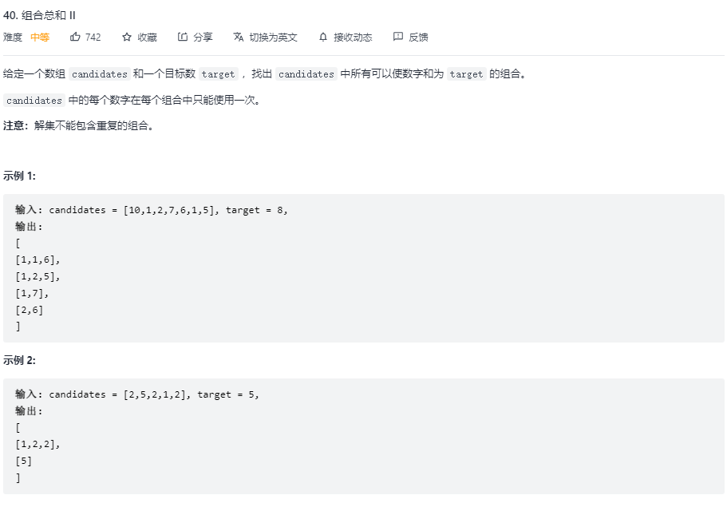
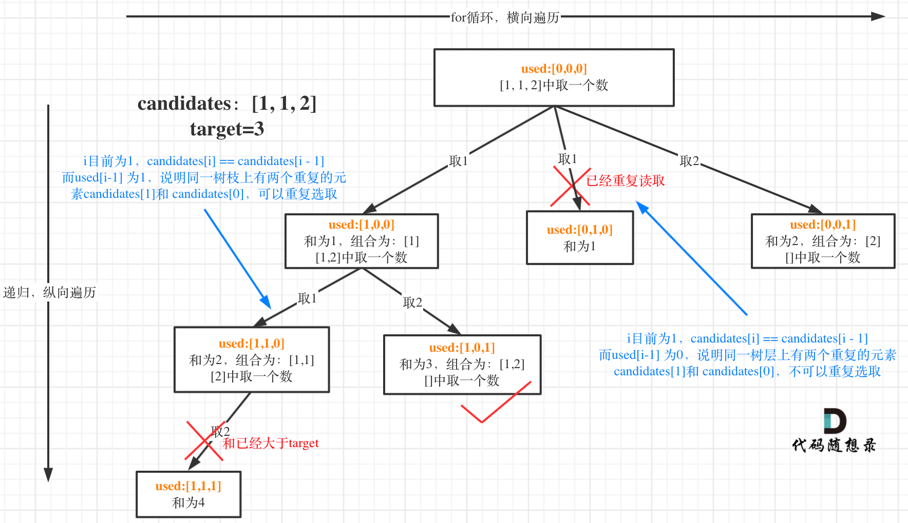
```javascript
/**
 * @param {number[]} candidates
 * @param {number} target
 * @return {number[][]}
 */
var combinationSum2 = function (candidates, target) {
    const res = []; path = [], len = candidates.length;
    candidates.sort((a, b) => a - b);
    backtracking(0, 0);
    return res;
    function backtracking(sum, i) {
        if (sum > target) return;
        if (sum === target) {
            res.push(Array.from(path));
            return;
        }
        let f = -1; // 标记是否使用过
        for (let j = i; j < len; j++) {
            const n = candidates[j];
            if (n > target - sum || n === f) continue;
            path.push(n);
            sum += n;
            f = n; // 标记是否用过
            backtracking(sum, j + 1);
            path.pop();
            sum -= n;
        }
    }
};
```


### 分割回文串
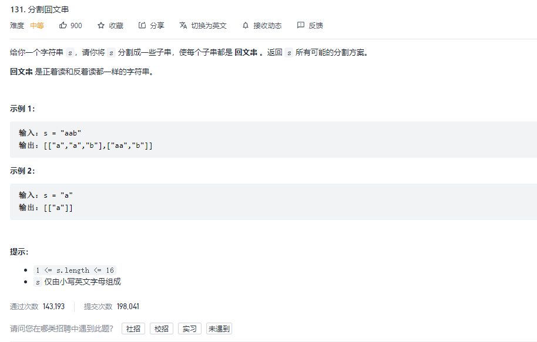
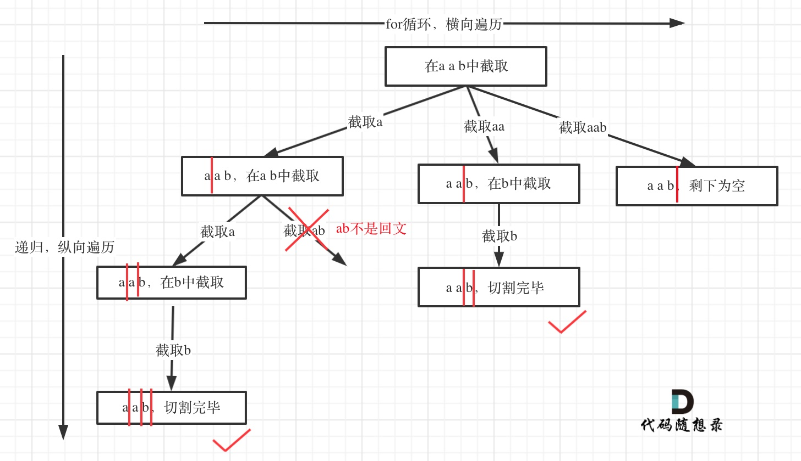
```javascript
/**
 * @param {string} s
 * @return {string[][]}
 */
const isPalindrome = (s, l, r) => {
    for (let i = l, j = r; i < j; i++, j--) {
        if (s[i] !== s[j]) return false;
    }
    return true;
}

var partition = function (s) {
    const res = [], path = [], len = s.length;
    backtracking(0);
    return res;
    function backtracking(i) {
        if (i >= len) {
            res.push(Array.from(path));
            return;
        }
        for (let j = i; j < len; j++) {
            if (!isPalindrome(s, i, j)) continue; // 检测是否是回文串
            path.push(s.substr(i, j - i + 1));
            backtracking(j + 1);
            path.pop();
        }
    }
};
```


### 复原 IP 地址
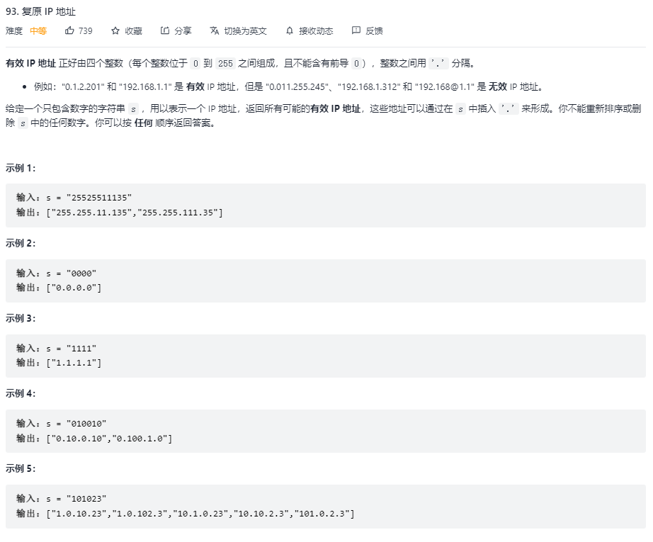
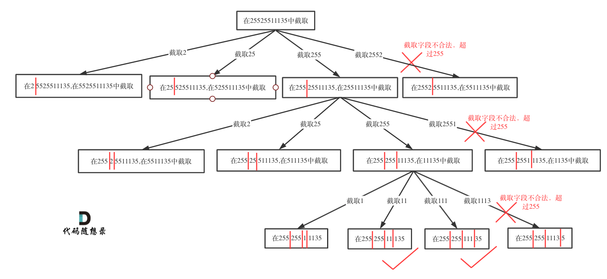

```javascript
/**
 * @param {string} s
 * @return {string[]}
 */
var restoreIpAddresses = function (s) {
    const res = [], path = [];
    backtracking(0, 0)
    return res;
    function backtracking(i) {
        const len = path.length;
        if (len > 4) return; // 
        if (len === 4 && i === s.length) { // 刚好切割完
            res.push(path.join("."));
            return;
        }
        for (let j = i; j < s.length; j++) {
            const str = s.substr(i, j - i + 1); // 截取字符串
            if (str.length > 3 || +str > 255) break; // 剪枝
            if (str.length > 1 && str[0] === "0") break; // 剪枝
            path.push(str);
            backtracking(j + 1);
            path.pop()
        }
    }
};
```


### 子集
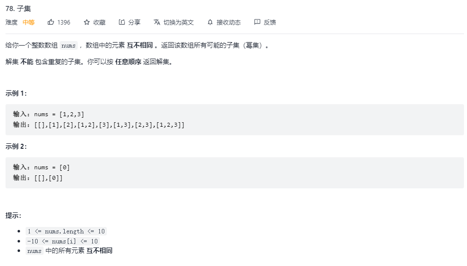
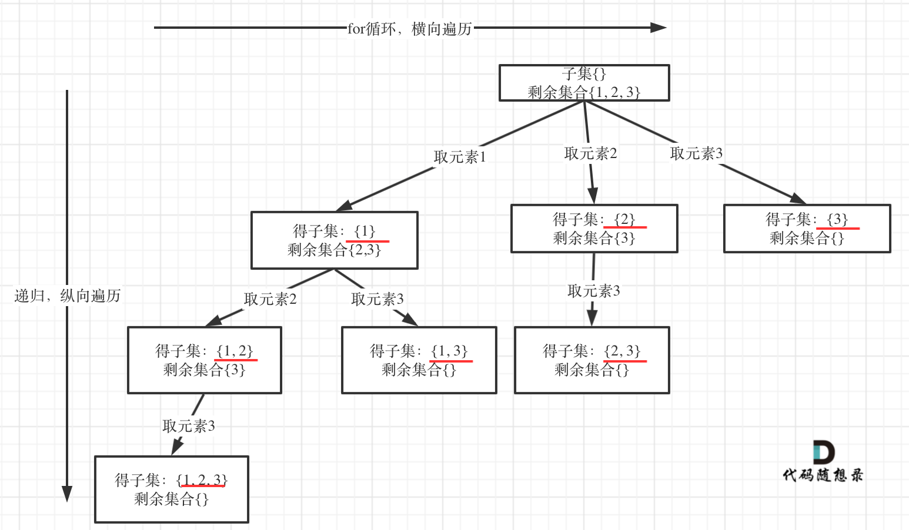
从图中红线部分，可以看出**遍历这个树的时候，把所有节点都记录下来，就是要求的子集集合**
```javascript
/**
 * @param {number[]} nums
 * @return {number[][]}
 */
var subsets = function (nums) {
    let result = [], path = []
    backtracking(0)
    return result
    function backtracking(startIndex) {
        result.push(path.slice())
        for (let i = startIndex; i < nums.length; i++) {
            path.push(nums[i])
            backtracking(i + 1)
            path.pop()
        }
    }
};
```


### 子集II
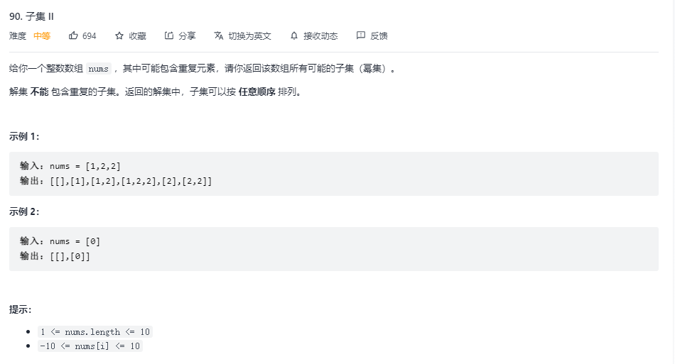
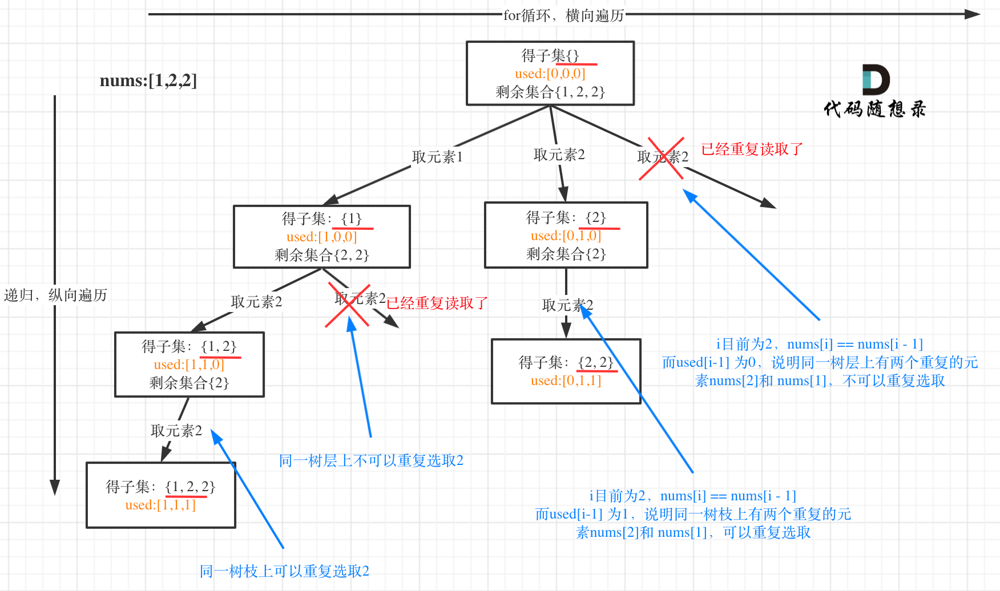
```javascript
/**
 * @param {number[]} nums
 * @return {number[][]}
 */
var subsetsWithDup = function (nums) {
    let result = [], path = []
    nums.sort((a, b) => a - b) // 排序
    backtracing(0)
    return result
    function backtracing(startIndex) {
        result.push(path.slice())
        if (startIndex > nums.length - 1) {
            return // 剪枝
        }
        for (let i = startIndex; i < nums.length; i++) {
            if (i > startIndex && nums[i] === nums[i - 1]) {
                continue  // 剪枝
            }
            path.push(nums[i])
            backtracing(i + 1)
            path.pop()
        }
    }
};
```

### 递增子序列
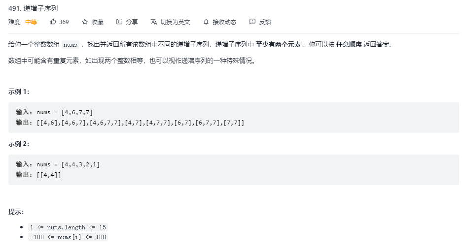
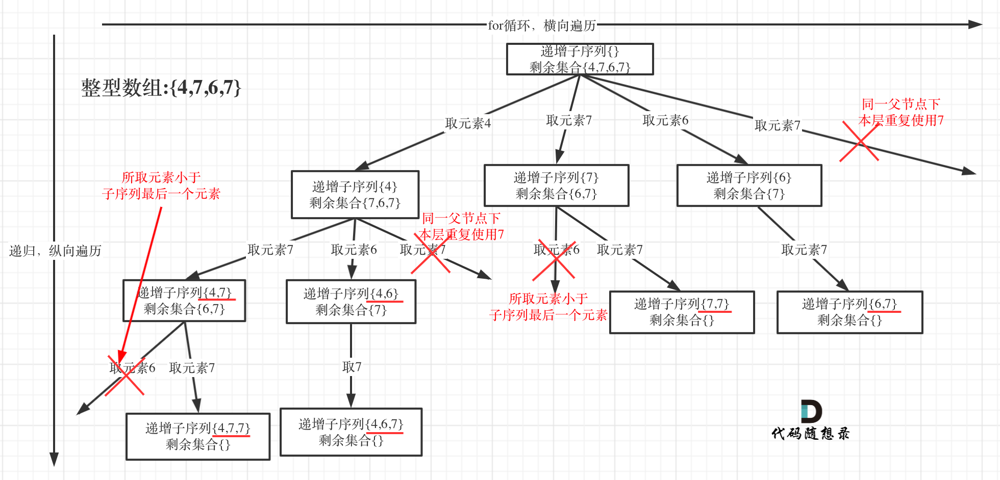
```javascript
/**
 * @param {number[]} nums
 * @return {number[][]}
 */
/**
 * @param {number[]} nums
 * @return {number[][]}
 */
var findSubsequences = function (nums) {
    let result = [], path = []
    backtracing(0)
    return result
    function backtracing(startIndex) {
        if (path.length > 1) {
            result.push(path.slice())
        }
        let uset = {}
        for (let i = startIndex; i < nums.length; i++) {
            // 所取元素小于最后一个元素, uset[nums[i]]在同层中已经取过
            if ((nums[i] < path[path.length - 1]) || uset[nums[i]]) {
                continue
            }
            uset[nums[i]] = true
            path.push(nums[i])
            backtracing(i + 1)
            path.pop()
        }
    }

};
```

### 全排列
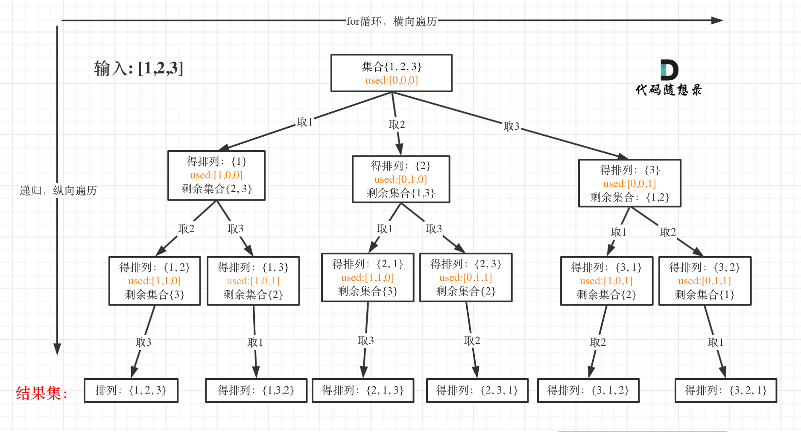
```javascript
/**
 * @param {number[]} nums
 * @return {number[][]}
 */
var permute = function (nums) {
    const res = [], path = [], len = nums.length, used = [];
    backtracking();
    return res;

    function backtracking() {
        if (path.length === len) {
            res.push(Array.from(path));
            return;
        }
        for (let i = 0; i < len; i++) {
            if (used[i]) continue; // 剪枝
            path.push(nums[i]);
            used[i] = true; // 同支
            backtracking();
            path.pop();
            used[i] = false;
        }
    }
};
```


### 全排列 II
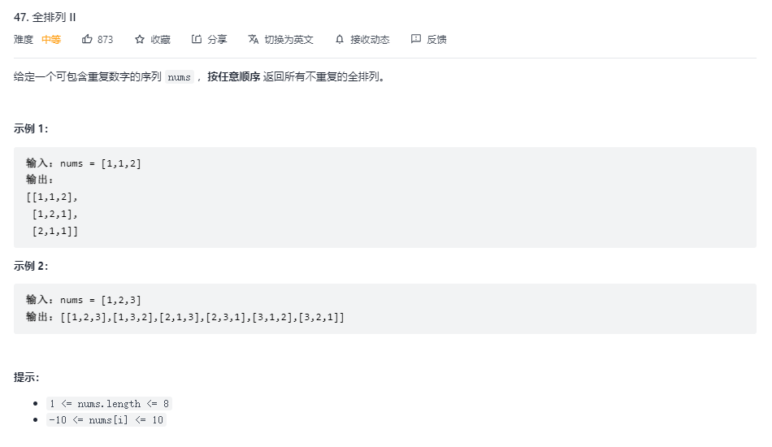
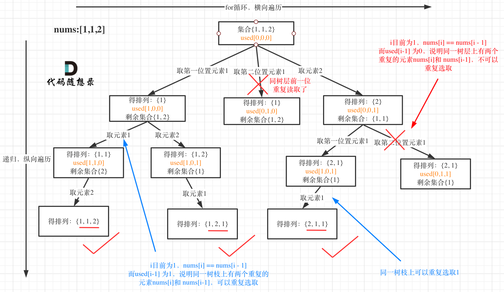
![@树层上去重(used[i - 1] == false)](./1638027002774.png)
![@树枝上去重used[i - 1] == true](./1638027007635.png)

```javascript
var permuteUnique = function (nums) {
    nums.sort((a, b) => a - b) // 排序去重
    let result = [], path = [], used = []
    backtracing()
    return result

    function backtracing() {
        if (path.length === nums.length) {
            result.push(path.slice())
            return
        }
        for (let i = 0; i < nums.length; i++) {
            if (i > 0 && nums[i] === nums[i - 1] && !used[i - 1]) {
                continue // 剪枝
            }
            if (used[i]) continue;
            used[i] = true
            path.push(nums[i])
            backtracing()
            path.pop()
            used[i] = false
        }
    }
};
```