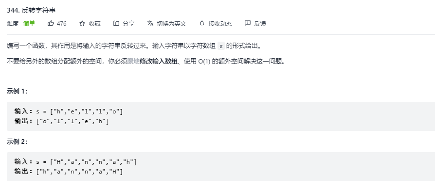
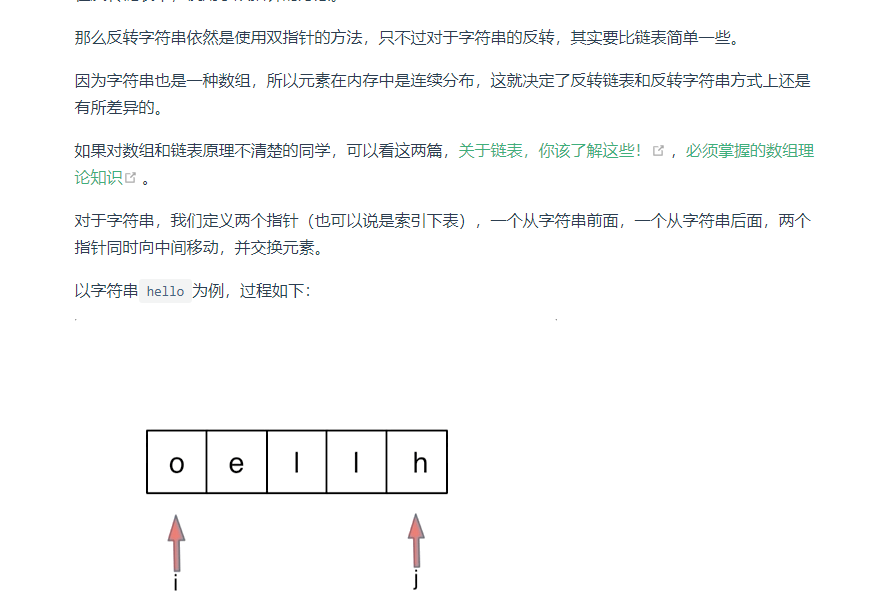
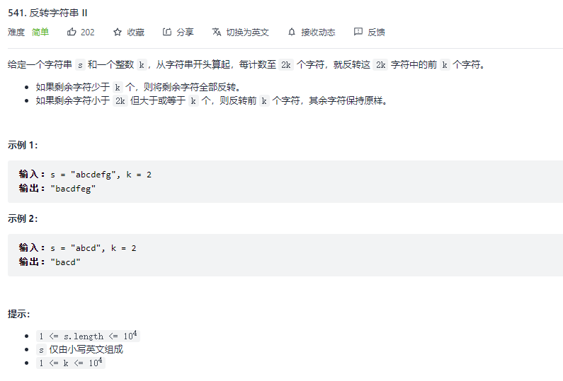
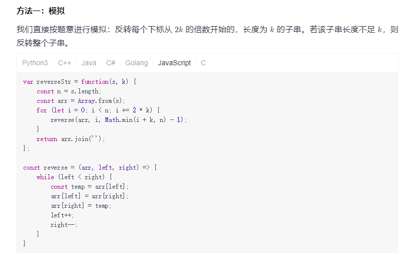
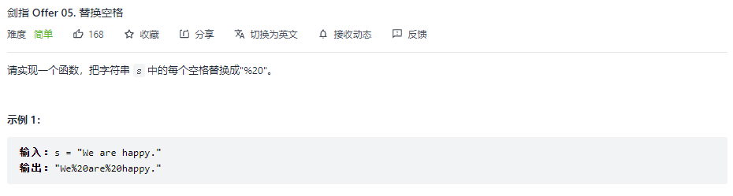
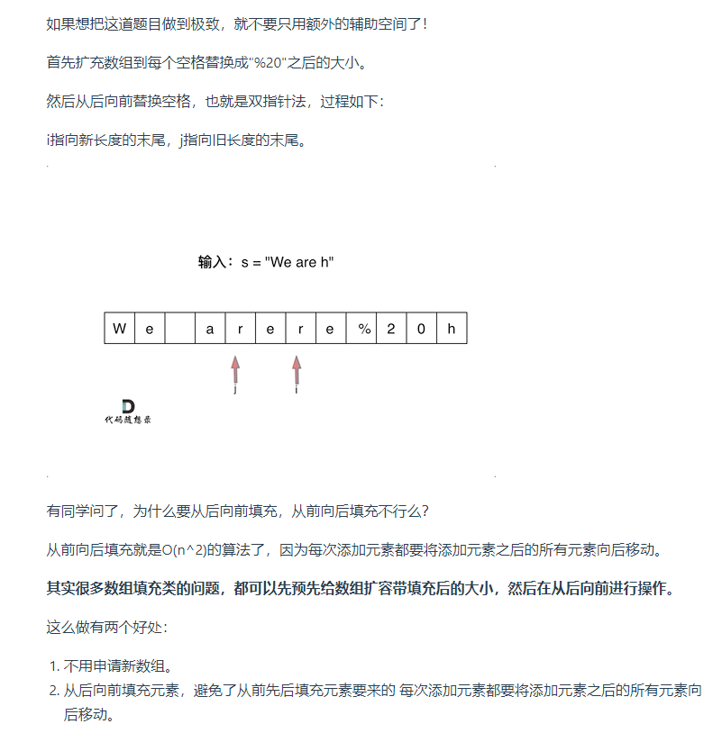
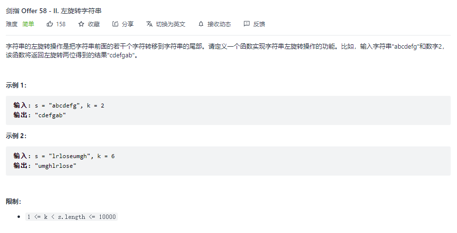
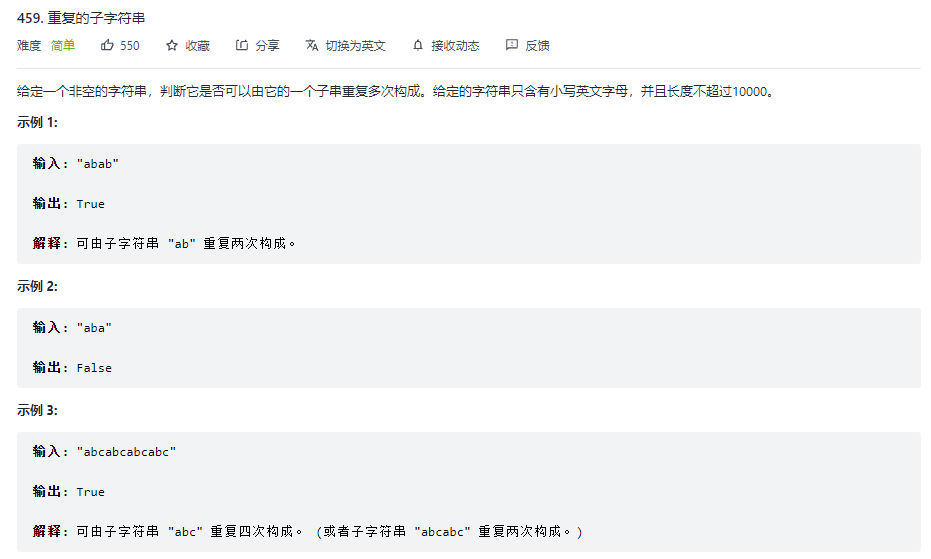

# 算法--字符串
@(前端面试)[面试, 字符串]


### 反转字符串


```javascript
/**
 * @param {character[]} s
 * @return {void} Do not return anything, modify s in-place instead.
 */
const reverseString = function (s) {
    // 双指针
    let n = s.length; // s是一个字符数组
    for (let left = 0, right = n - 1; left < right; left++, right--) {
        [s[left], s[right]] = [s[right], s[left]];
    }
};
```


### 反转字符串 II


```javascript
/**
 * @param {string} s
 * @param {number} k
 * @return {string}
 */
// 每隔k个反转k个，末尾不够k个时全部反转
var reverseStr = function (s, k) {
    const n = s.length;
    const arr = Array.from(s); // 字符数组
    for (let i = 0; i < n; i += 2 * k) {
        reverse(arr, i, Math.min(i + k, n) - 1);
    }
    return arr.join('');
};

const reverse = (strArr, l, r) => {
    for (let i = l, j = r; i < j; i++, j--) {
        [strArr[i], strArr[j]] = [strArr[j], strArr[i]]
    }
}
```


### 替换空格


```javascript
const replaceSpace = s => {
    // 伪数组对象或可迭代对象
    const strArr = Array.from(s)
    let count = strArr.filter(item => item === ' ').length; // 计算空格数量
    let left = strArr.length - 1
    let right = strArr.length + count * 2 - 1
    while (left >= 0) { // 双指针 从后向前移动
        if (strArr[left] === ' ') {
            strArr[right--] = '0'
            strArr[right--] = '2'
            strArr[right--] = '%'
            left--
        } else {
            strArr[right--] = strArr[left--]
        }
    }
    return strArr.join('')
}
```


### 左旋转字符串


```javascript
/**
 * @param {string} s
 * @param {number} n
 * @return {string}
 */
const reverseLeftWords = function (s, n) {
	// return s.slice(n) + s.slice(0, n)
	let str = '';
	for (let i = n; i < s.length; i++) {
		str += s[i];
	}
	for (let i = 0; i < n; i++) {
		str += s[i];
	}
	return str;
};
```

### 重复的子字符串

```javascript
/**
 * @param {string} s
 * @return {boolean}
 */
var repeatedSubstringPattern = function(s) {
  var reg = /^(\w+)\1+$/
  return reg.test(s)
};
```


