# 算法---链表
@(前端面试)[面试, 算法]


## 关于链表，你该了解这些！
>什么是链表，链表是一种通过指针串联在一起的线性结构，每一个节点由两部分组成，一个是数据域一个是指针域（存放指向下一个节点的指针），最后一个节点的指针域指向null（空指针的意思）。
>链接的入口节点称为链表的头结点也就是head。
>如图所示：


## 链表的类型
>接下来说一下链表的几种类型:
## 单链表
>刚刚说的就是单链表。

## 双链表
>单链表中的节点只能指向节点的下一个节点。
双链表：每一个节点有两个指针域，一个指向下一个节点，一个指向上一个节点。
双链表 既可以向前查询也可以向后查询。
>
>如图所示：
>

### 循环链表
>循环链表，顾名思义，就是链表首尾相连。
>循环链表可以用来解决约瑟夫环问题。
>


## 链表的存储方式
>了解完链表的类型，再来说一说链表在内存中的存储方式。
数组是在内存中是连续分布的，但是链表在内存中可不是连续分布的。
链表是通过指针域的指针链接在内存中各个节点。
所以链表中的节点在内存中不是连续分布的 ，而是散乱分布在内存中的某地址上，分配机制取决于操作系统的内存管理。
>如图所示：
>
这个链表起始节点为2， 终止节点为7，  各个节点分布在内存个不同地址空间上，通过指针串联在一起。

## 链表的定义
>接下来说一说链表的定义。
链表节点的定义，很多同学在面试的时候都写不好。
这是因为平时在刷leetcode的时候，链表的节点都默认定义好了，直接用就行了，所以同学们都没有注意到链表的节点是如何定义的。
而在面试的时候，一旦要自己手写链表，就写的错漏百出。
>这里我给出C/C++的定义链表节点方式，如下所示：
>```
// 单链表
struct ListNode {
    int val;  // 节点上存储的元素
    ListNode *next;  // 指向下一个节点的指针
    ListNode(int x) : val(x), next(NULL) {}  // 节点的构造函数
};
>```
>有同学说了，我不定义构造函数行不行，答案是可以的，C++默认生成一个构造函数。
但是这个构造函数不会初始化任何成员变量，下面我来举两个例子：
通过自己定义构造函数初始化节点：
>```
ListNode* head = new ListNode(5);
>```
>使用默认构造函数初始化节点：
>```
ListNode* head = new ListNode();
head->val = 5;
>```
>所以如果不定义构造函数使用默认构造函数的话，在初始化的时候就不能直接给变量赋值！

## 链表的操作
### 删除节点
>删除D节点，如图所示：
>
>只要将C节点的next指针 指向E节点就可以了。
那有同学说了，D节点不是依然存留在内存里么？只不过是没有在这个链表里而已。
是这样的，所以在C++里最好是再手动释放这个D节点，释放这块内存。
其他语言例如Java、Python，就有自己的内存回收机制，就不用自己手动释放了。

### 添加节点
>如图所示：
>
>可以看出链表的增添和删除都是O(1)操作，也不会影响到其他节点。
但是要注意，要是删除第五个节点，需要从头节点查找到第四个节点通过next指针进行删除操作，查找的时间复杂度是O(n)。

## 性能分析
>再把链表的特性和数组的特性进行一个对比，如图所示：
>
>数组在定义的时候，长度就是固定的，如果想改动数组的长度，就需要重新定义一个新的数组。
链表的长度可以是不固定的，并且可以动态增删， 适合数据量不固定，频繁增删，较少查询的场景。
相信大家已经对链表足够的了解，后面我会讲解关于链表的高频面试题目，我们下期见！


### 移除链表元素
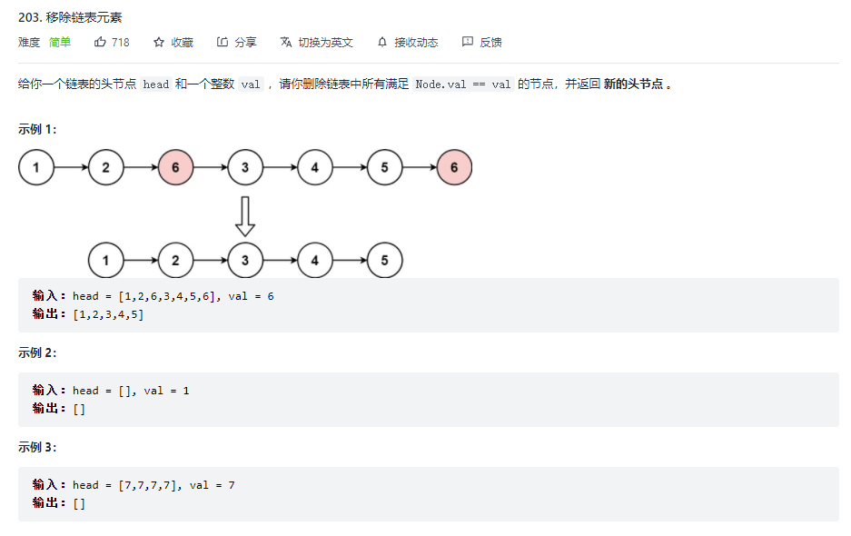
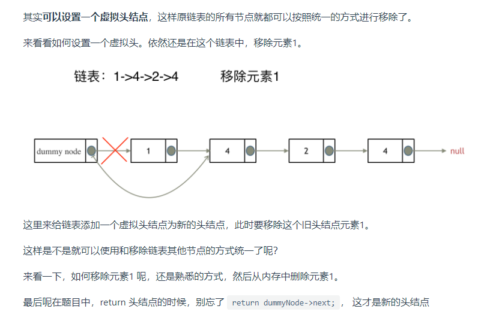
```javascript
/**
 * Definition for singly-linked list.
 * function ListNode(val, next) {
 *     this.val = (val===undefined ? 0 : val)
 *     this.next = (next===undefined ? null : next)
 * }
 */
/**
 * @param {ListNode} head
 * @param {number} val
 * @return {ListNode}
 */

class ListNode {
    constructor(val = 0, next = null) {
        this.val = val
        this.next = next
    }
}

const removeElements = (head, val) => {
    let dummyNode = new ListNode(0, head)
    let cur = dummyNode
    while (cur.next) {
        if (cur.next.val === val) {
            cur.next = cur.next.next
        } else {
            cur = cur.next
        }
    }
    return dummyNode.next
}
```

### 设计链表
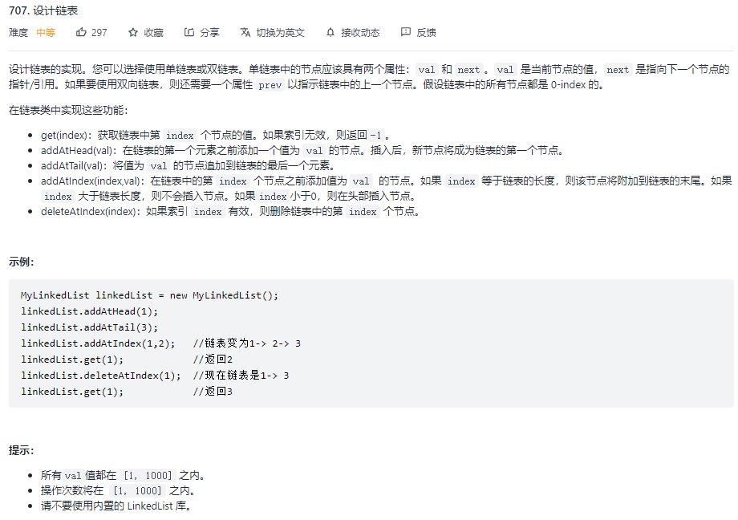
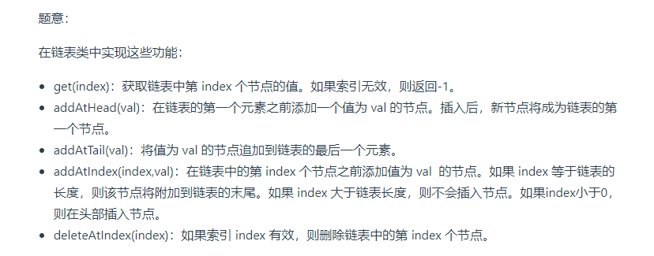
```javascript
class LinkNode {
  constructor (val, next) {
    this.val = val
    this.next = next
  }
}

class MyLinkedList {
  /**
   * Initialize your data structure here.
   * 单链表 储存头尾节点 和 节点数量
   */
  constructor () {
    this._size = 0
    this._tail = null
    this._head = null
  }

  /**
   * Add a node of value val before the first element of the linked list. After the insertion, the new node will be the first node of the linked list.
   * @param {number} val
   * @return {void}
   */
  addAtHead (val) {
    const node = new LinkNode(val, this._head)
    this._head = node
    this._size++
    if (!this._tail) {
      this._tail = node
    }
  }

  /**
   * Append a node of value val to the last element of the linked list.
   * @param {number} val
   * @return {void}
   */
  addAtTail (val) {
    const node = new LinkNode(val, null)
    this._size++
    if (this._tail) {
      this._tail.next = node
      this._tail = node
      return
    }
    this._tail = node
    this._head = node
  }

  /**
   * Get the value of the index-th node in the linked list. If the index is invalid, return -1.
   * @param {number} index
   * @return {number}
   */
  getNode (index) {
    if (index < 0 || index >= this._size) return null
    // 创建虚拟头节点
    let cur = new LinkNode(0, this._head)
    // 0 -> head
    while (index-- >= 0) {
      cur = cur.next
    }
    return cur
  }

  get (index) {
    if (index < 0 || index >= this._size) return -1
    // 获取当前节点
    return this.getNode(index).val
  }

  /**
   * Add a node of value val before the index-th node in the linked list.
   * If index equals to the length of linked list, the node will be appended to the end of linked list.
   *  If index is greater than the length, the node will not be inserted.
   * @param {number} index
   * @param {number} val
   * @return {void}
   */
  addAtIndex (index, val) {
    if (index > this._size) return
    if (index <= 0) {
      this.addAtHead(val)
      return
    }
    if (index === this._size) {
      this.addAtTail(val)
      return
    }
    // 获取目标节点的上一个的节点
    const node = this.getNode(index - 1)
    node.next = new LinkNode(val, node.next)
    this._size++
  }
  /**
   * Delete the index-th node in the linked list, if the index is valid.
   * @param {number} index
   * @return {void}
   */
  deleteAtIndex (index) {
    if (index < 0 || index >= this._size) return
    if (index === 0) {
      this._head = this._head.next
      this._size--
      return
    }
    // 获取目标节点的上一个的节点
    const node = this.getNode(index - 1)
    node.next = node.next.next
    // 处理尾节点
    if (index === this._size - 1) {
      this._tail = node
    }
    this._size--
  }
}
```


### 反转链表
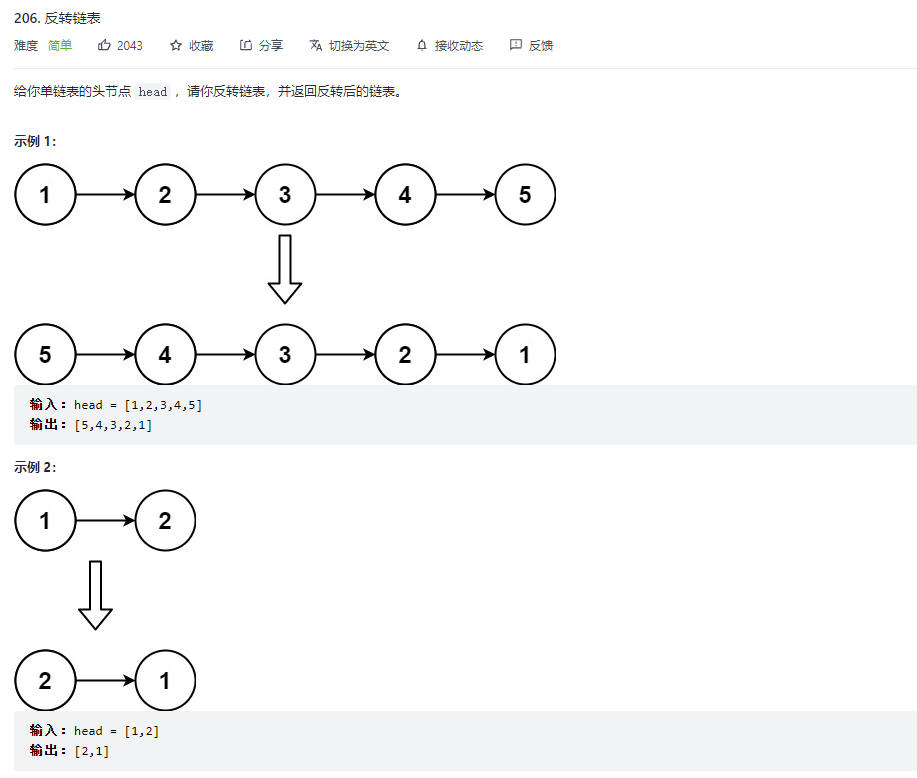

```javascript
/**
 * Definition for singly-linked list.
 * function ListNode(val) {
 *     this.val = val;
 *     this.next = null;
 * }
 */
/**
 * @param {ListNode} head
 * @return {ListNode}
 */
var reverseList = function (head) {
    let pre = null;  // 最开始是null
    let cur = head; // 头节点
    while (cur) {
        const temp = cur.next;  // 保存临时节点
        cur.next = pre;
        pre = cur;
        cur = temp;
    }
    return pre;
}
```


### 两两交换链表中的节点
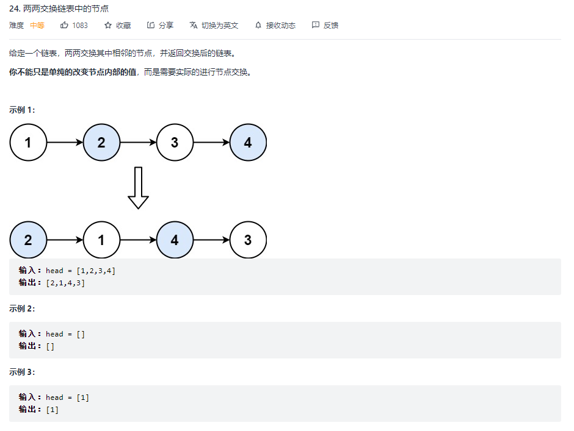

```javascript
/**
 * Definition for singly-linked list.
 * function ListNode(val, next) {
 *     this.val = (val===undefined ? 0 : val)
 *     this.next = (next===undefined ? null : next)
 * }
 */
/**
 * @param {ListNode} head
 * @return {ListNode}
 */
var swapPairs = function (head) {
    let dummyNode = new ListNode(0, head), temp = dummyNode;
    while (temp.next && temp.next.next) {
        let cur = temp.next.next, pre = temp.next;
        pre.next = cur.next;
        cur.next = pre;
        temp.next = cur;
        temp = pre; // 更新节点
    }
    return dummyNode.next;
};
```


### 删除链表的倒数第 N 个结点
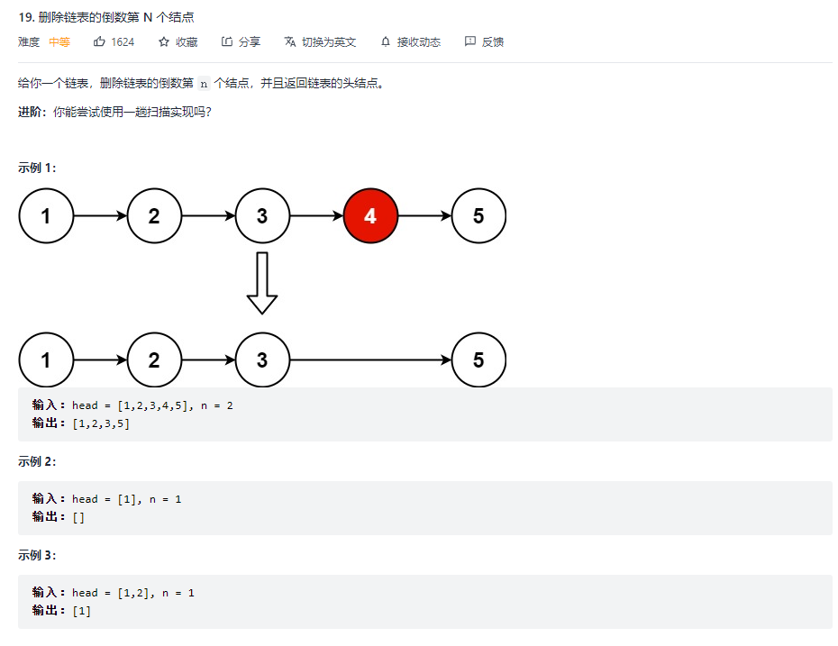
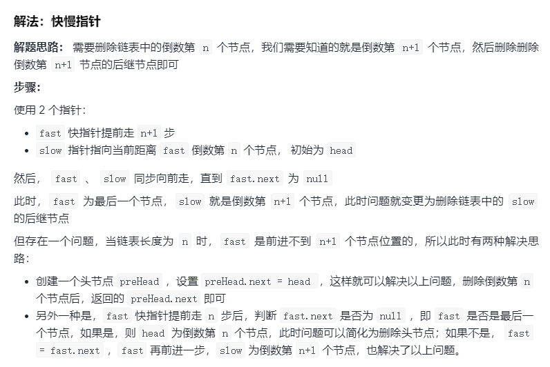
```javascript
var removeNthFromEnd = function(head, n) {
    let preHead = new ListNode(0,head)
    let fast = preHead, slow = preHead
    // 快先走 n+1 步
    while(n--) {
        fast = fast.next
    }
    // fast、slow 一起前进
    while(fast && fast.next) {
        fast = fast.next
        slow = slow.next
    }
    slow.next = slow.next.next
    return preHead.next
};
```


### 相交链表
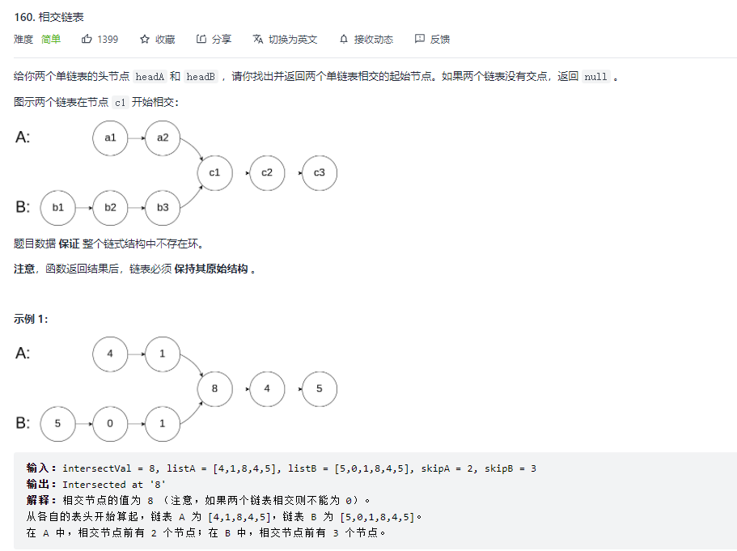
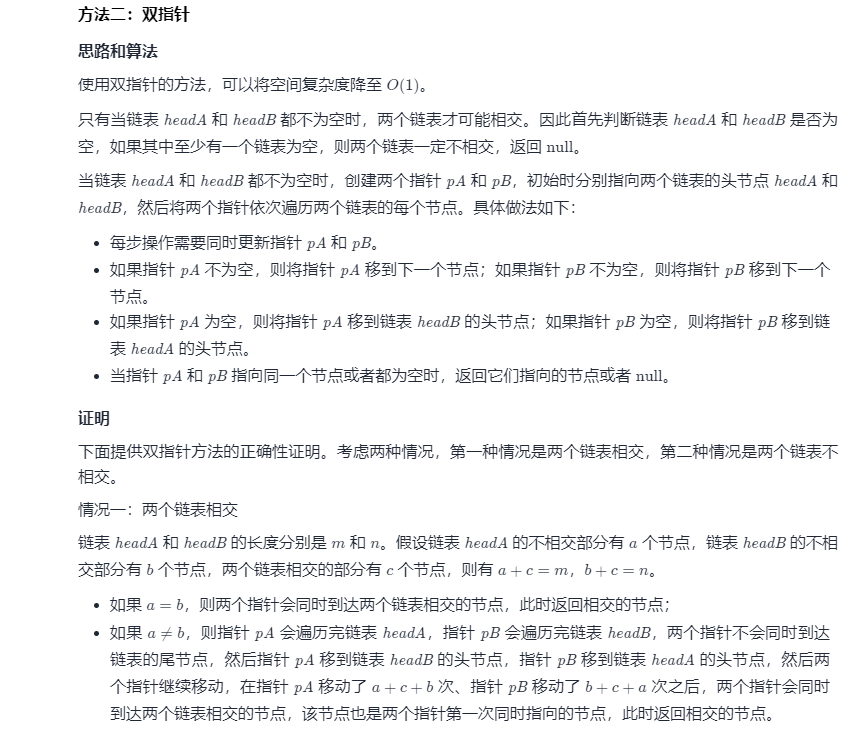
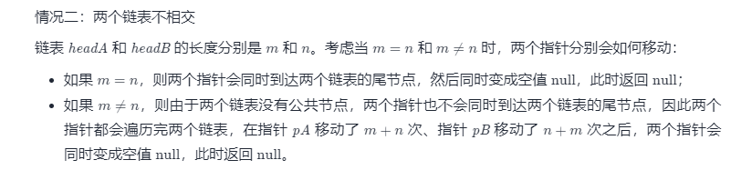
```javascript
var getIntersectionNode = function(headA, headB) {
    if (headA === null || headB === null) {
        return null;
    }
    let pA = headA, pB = headB;
    while (pA !== pB) {
        pA = pA === null ? headB : pA.next;
        pB = pB === null ? headA : pB.next;
    }
    return pA;
};
```


### 环形链表II
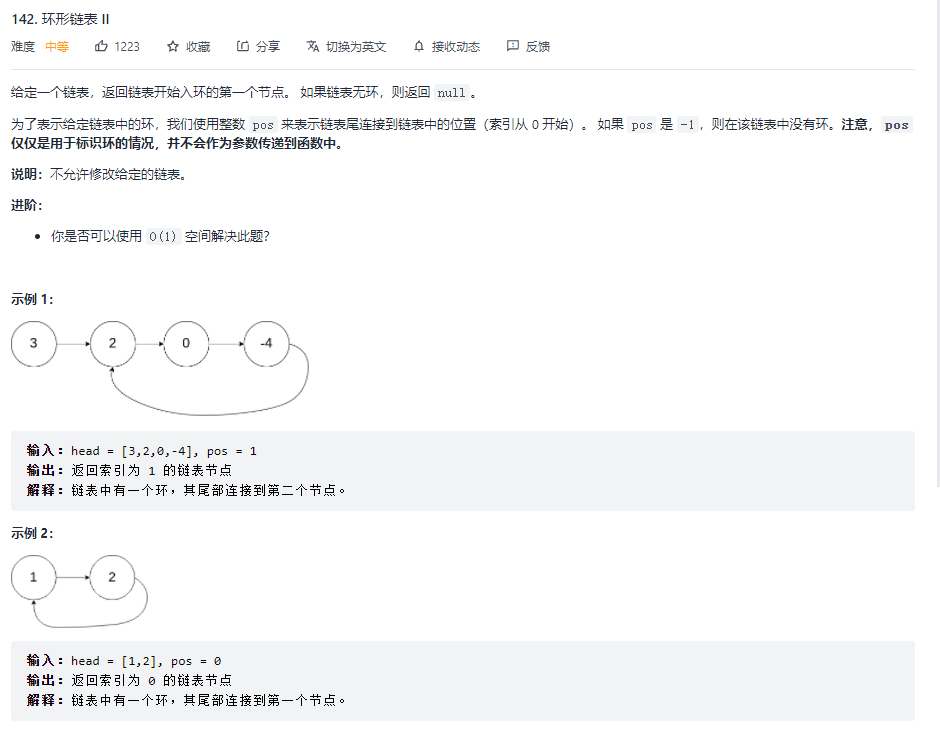
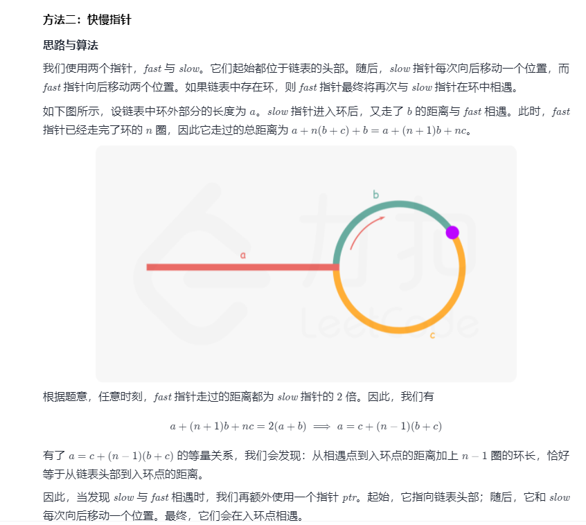
```javascript
/**
 * Definition for singly-linked list.
 * function ListNode(val) {
 *     this.val = val;
 *     this.next = null;
 * }
 */


/**
 * @param {ListNode} head
 * @return {boolean}
 */
var hasCycle = function (head) {
    if (!head || !head.next) {
        return false;
    }
    let slow = head;
    let fast = head;
    while (fast && fast.next) {
        slow = slow.next;
        fast = fast.next.next;
        if (fast === slow) {
            return slow;
        }
    }
    return false;
};

/**
 * @param {ListNode} head
 * @return {ListNode}
 */
var detectCycle = function (head) {
    let meet = hasCycle(head);
    if (!meet) {
        return null
    }
    let ptr = head; // 新建一个节点
    while (ptr !== meet) { // 相遇时就是交点
        ptr = ptr.next;
        meet = meet.next;
    }
    return ptr;
};
```


## 链表的理论基础

在这篇文章[关于链表，你该了解这些！](https://programmercarl.com/链表理论基础.html)中，介绍了如下几点：

* 链表的种类主要为：单链表，双链表，循环链表
* 链表的存储方式：链表的节点在内存中是分散存储的，通过指针连在一起。
* 链表是如何进行增删改查的。
* 数组和链表在不同场景下的性能分析。

**可以说把链表基础的知识都概括了，但又不像教科书那样的繁琐**。

## 链表经典题目
### 虚拟头结点
在[链表：听说用虚拟头节点会方便很多？](https://programmercarl.com/0203.移除链表元素.html)中，我们讲解了链表操作中一个非常总要的技巧：虚拟头节点。
链表的一大问题就是操作当前节点必须要找前一个节点才能操作。这就造成了，头结点的尴尬，因为头结点没有前一个节点了。
**每次对应头结点的情况都要单独处理，所以使用虚拟头结点的技巧，就可以解决这个问题**。
在[链表：听说用虚拟头节点会方便很多？](https://programmercarl.com/0203.移除链表元素.html)中，我给出了用虚拟头结点和没用虚拟头结点的代码，大家对比一下就会发现，使用虚拟头结点的好处。
### 链表的基本操作
在[链表：一道题目考察了常见的五个操作！](https://programmercarl.com/0707.设计链表.html)中，我们通设计链表把链表常见的五个操作练习了一遍。
这是练习链表基础操作的非常好的一道题目，考察了：
* 获取链表第index个节点的数值
* 在链表的最前面插入一个节点
* 在链表的最后面插入一个节点
* 在链表第index个节点前面插入一个节点
* 删除链表的第index个节点的数值

**可以说把这道题目做了，链表基本操作就OK了，再也不用担心链表增删改查整不明白了**。

这里我依然使用了虚拟头结点的技巧，大家复习的时候，可以去看一下代码。

### 反转链表

在[链表：听说过两天反转链表又写不出来了？](https://programmercarl.com/0206.翻转链表.html)中，讲解了如何反转链表。
因为反转链表的代码相对简单，有的同学可能直接背下来了，但一写还是容易出问题。
反转链表是面试中高频题目，很考察面试者对链表操作的熟练程度。
我在[文章](https://programmercarl.com/0206.翻转链表.html)中，给出了两种反转的方式，迭代法和递归法。
建议大家先学透迭代法，然后再看递归法，因为递归法比较绕，如果迭代还写不明白，递归基本也写不明白了。
**可以先通过迭代法，彻底弄清楚链表反转的过程！**

### 删除倒数第N个节点
在[链表：删除链表倒数第N个节点，怎么删？](https://programmercarl.com/0019.删除链表的倒数第N个节点.html)中我们结合虚拟头结点 和 双指针法来移除链表倒数第N个节点。


### 链表相交
[链表：链表相交](https://programmercarl.com/面试题02.07.链表相交.html)使用双指针来找到两个链表的交点（引用完全相同，即：内存地址完全相同的交点）

### 环形链表
在[链表：环找到了，那入口呢？](https://programmercarl.com/0142.环形链表II.html)中，讲解了在链表如何找环，以及如何找环的入口位置。
这道题目可以说是链表的比较难的题目了。 但代码却十分简洁，主要在于一些数学证明。

## 总结
考察链表的操作其实就是考察指针的操作，是面试中的常见类型。
链表篇中开头介绍[链表理论知识](https://programmercarl.com/0203.移除链表元素.html)，然后分别通过经典题目介绍了如下知识点：
1. [关于链表，你该了解这些！](https://programmercarl.com/链表理论基础.html)
2. [虚拟头结点的技巧](https://programmercarl.com/0203.移除链表元素.html)
3. [链表的增删改查](https://programmercarl.com/0707.设计链表.html)
4. [反转一个链表](https://programmercarl.com/0206.翻转链表.html)
5. [删除倒数第N个节点](https://programmercarl.com/0019.删除链表的倒数第N个节点.html)
6. [链表相交](https://programmercarl.com/面试题02.07.链表相交.html)
7. [有否环形，以及环的入口](https://programmercarl.com/0142.环形链表II.html)


