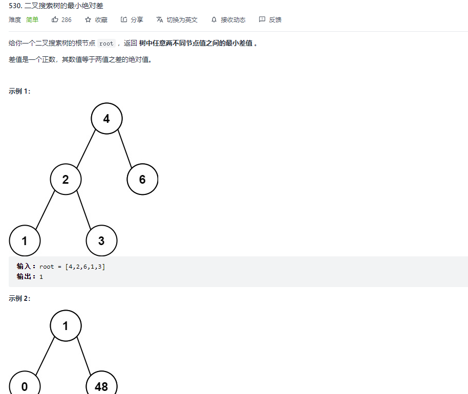
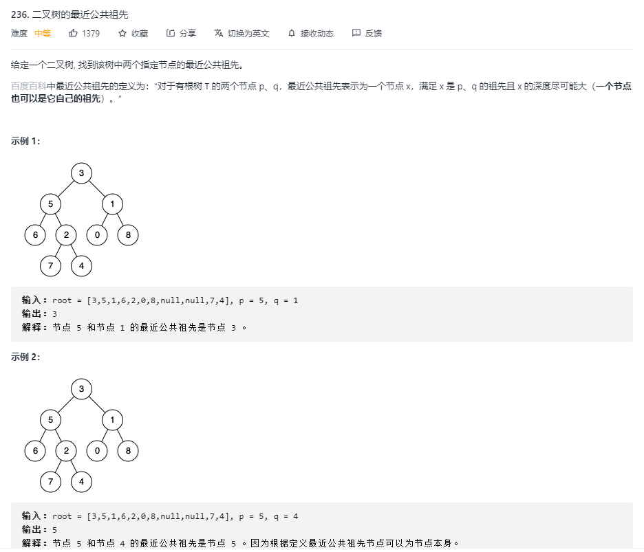
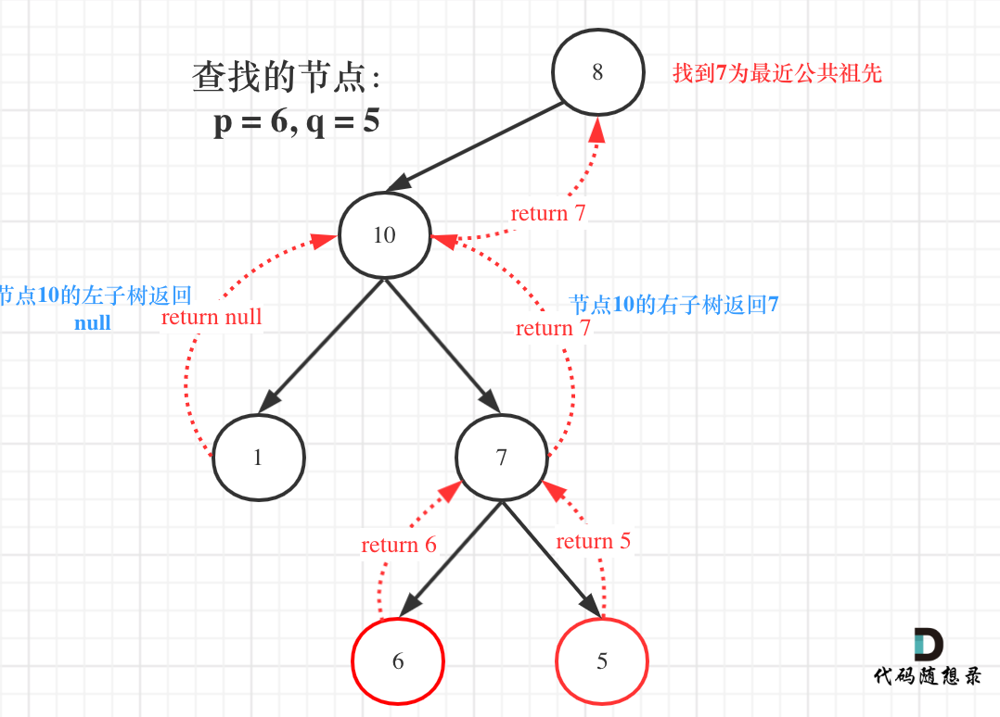
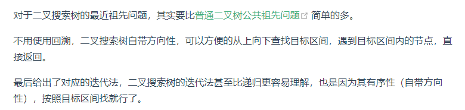
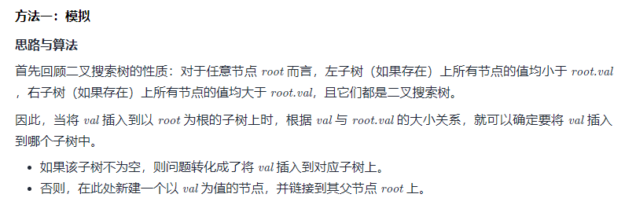
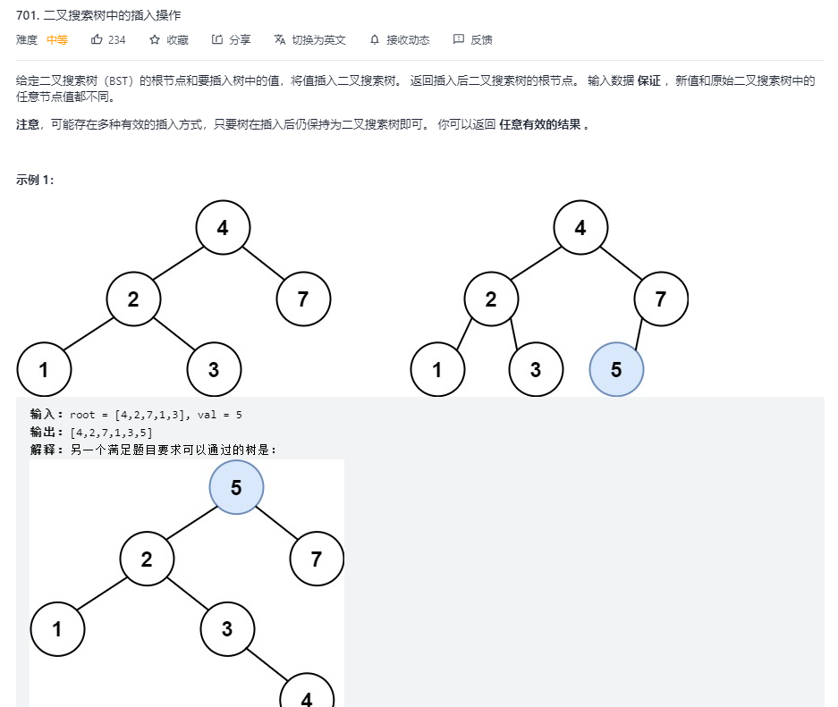
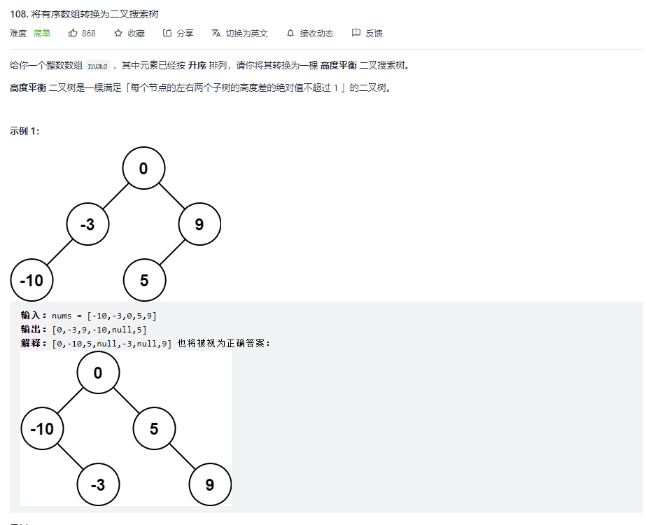
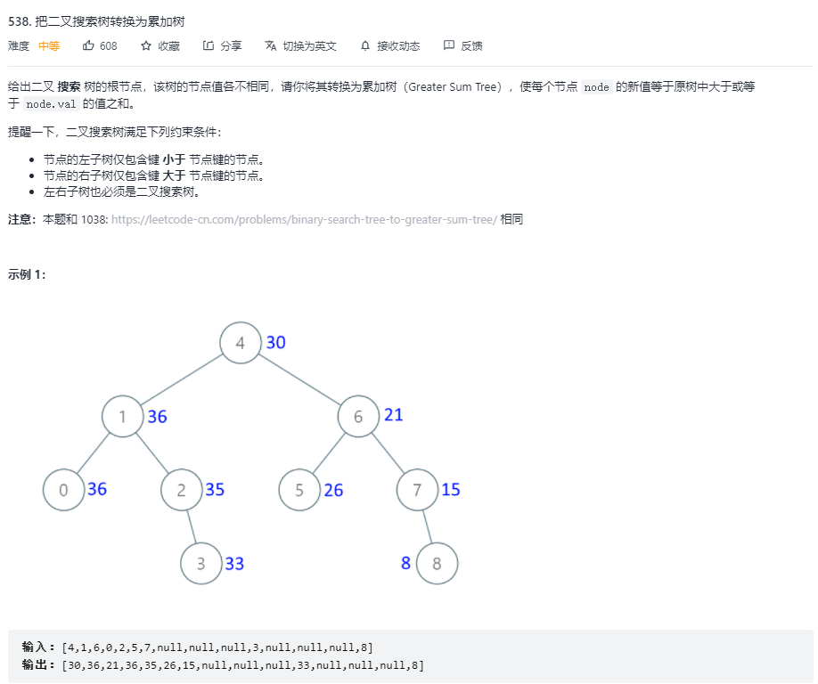

# 算法---二叉树2
@(前端面试)[面试, 算法]

### 二叉搜索树的最小绝对差

```javascript
/**
 * Definition for a binary tree node.
 * function TreeNode(val, left, right) {
 *     this.val = (val===undefined ? 0 : val)
 *     this.left = (left===undefined ? null : left)
 *     this.right = (right===undefined ? null : right)
 * }
 */
/**
 * @param {TreeNode} root
 * @return {number}
 */

var getMinimumDifference = function (root) {
    // preNode 前一个节点
    let preNode = null, res = Infinity
    const compare = (node) => {
        if (preNode) { res = Math.min(res, node.val - preNode.val) }
        preNode = node;
    }
    const dfs = (node) => {
        if (!node) return
        node.left && dfs(node.left)
        compare(node)
        node.right && dfs(node.right)
    }
    dfs(root)
    return res;
};
```
```javascript
/**
 * Definition for a binary tree node.
 * function TreeNode(val, left, right) {
 *     this.val = (val===undefined ? 0 : val)
 *     this.left = (left===undefined ? null : left)
 *     this.right = (right===undefined ? null : right)
 * }
 */
/**
 * @param {TreeNode} root
 * @return {number}
 */

var getMinimumDifference = function (root) {
    const res = []
    const dfs = (node) => {
        if (!node) return
        node.left && dfs(node.left)
        res.push(node.val)
        node.right && dfs(node.right)
    }
    dfs(root)
    let diff = Infinity;
    for (let i = 0, len = res.length; i < len; i++) {
        if (diff > res[i + 1] - res[i]) {
            diff = res[i + 1] - res[i]
        }
    }
    return diff
    // return res;
};
```
```javascript
var getMinimumDifference = function(root) {
    let stack = []
    let cur = root
    let res = Infinity
    let pre = null
    while(cur || stack.length) {
        if(cur) {
            stack.push(cur)
            cur = cur.left
        } else {
            cur = stack.pop()
            if(pre) res = Math.min(res, cur.val - pre.val)
            pre = cur
            cur = cur.right
        }
    }
    return res
}
```


### 二叉搜索树中的众数

```javascript
/**
 * Definition for a binary tree node.
 * function TreeNode(val, left, right) {
 *     this.val = (val===undefined ? 0 : val)
 *     this.left = (left===undefined ? null : left)
 *     this.right = (right===undefined ? null : right)
 * }
 */
/**
 * @param {TreeNode} root
 * @return {number[]}
 */
var findMode = function (root) {
    // preNode前一个node
    let preNode = root, count = 0, maxCount = -Infinity;
    let res = [];

    const update = (node) => {
        if (preNode.val === node.val) {
            count++;
        } else {
            preNode = node;
            count = 1
        }
        if (count === maxCount) {
            res.push(node.val)
        } else if (count > maxCount) { // 出现了更大的值
            maxCount = count;
            res = [node.val];
        }
    }
    // 二叉搜索树的中序遍历是一个有序的序列
    const dfs = (root) => {
        if (!root) return;
        dfs(root.left);
        update(root); // 3. 单层递归逻辑
        dfs(root.right);
    }
    dfs(root);
    return res;
};
```


### 二叉树的最近公共祖先


```javascript
/**
 * Definition for a binary tree node.
 * function TreeNode(val) {
 *     this.val = val;
 *     this.left = this.right = null;
 * }
 */
/**
 * @param {TreeNode} root
 * @param {TreeNode} p
 * @param {TreeNode} q
 * @return {TreeNode}
 */
var lowestCommonAncestor = function (root, p, q) {
    // 使用递归的方法
    // 需要从下到上，所以使用后序遍历
    // 1. 确定递归的函数
    const travelTree = function (root, p, q) {
        // 2. 确定递归终止条件
        if (root === null || root === p || root === q) {
            return root;
        }
        // 3. 确定递归单层逻辑
        let left = travelTree(root.left, p, q);
        let right = travelTree(root.right, p, q);
        if (left !== null && right !== null) {
            return root;
        }
        if (left === null) {
            return right;
        }
        return left;
    }
    return travelTree(root, p, q);
};
```



```javascript
/**
 * Definition for a binary tree node.
 * function TreeNode(val) {
 *     this.val = val;
 *     this.left = this.right = null;
 * }
 */
/**
 * @param {TreeNode} root
 * @param {TreeNode} p
 * @param {TreeNode} q
 * @return {TreeNode}
 */
var lowestCommonAncestor = function (root, p, q) {
    if (!root) return null;
    if (root.val > p.val && root.val > q.val) {
        return lowestCommonAncestor(root.left, p, q);
    }
    if (root.val < p.val && root.val < q.val) {
        return lowestCommonAncestor(root.right, p, q);
    }
    return root;
};
```
```javascript
var lowestCommonAncestor = function(root, p, q) {
    // 使用迭代的方法
    while(root) {
        if(root.val>p.val&&root.val>q.val) {
            root = root.left;
        }else if(root.val<p.val&&root.val<q.val) {
            root = root.right;
        }else {
            return root;
        }
        
    }
    return null;
};
```

### 二叉搜索树中的插入操作


```javascript
/**
 * Definition for a binary tree node.
 * function TreeNode(val, left, right) {
 *     this.val = (val===undefined ? 0 : val)
 *     this.left = (left===undefined ? null : left)
 *     this.right = (right===undefined ? null : right)
 * }
 */
/**
 * @param {TreeNode} root
 * @param {number} val
 * @return {TreeNode}
 */
var insertIntoBST = function (root, val) {
    if (root === null) {
        return new TreeNode(val);
    }
    let pos = root;
    while (pos !== null) {
        if (val < pos.val) {
            if (pos.left === null) {
                pos.left = new TreeNode(val);
                break;
            } else {
                pos = pos.left;
            }
        } else {
            if (pos.right === null) {
                pos.right = new TreeNode(val);
                break;
            } else {
                pos = pos.right;
            }
        }
    }
    return root;

};
```


### 将有序数组转换为二叉搜索树

```javascript
/**
 * Definition for a binary tree node.
 * function TreeNode(val, left, right) {
 *     this.val = (val===undefined ? 0 : val)
 *     this.left = (left===undefined ? null : left)
 *     this.right = (right===undefined ? null : right)
 * }
 */
/**
 * @param {number[]} nums
 * @return {TreeNode}
 */
// 取中间节点作为根节点动构造二叉树 
var sortedArrayToBST = function (nums) {
    if (!nums.length) return null;
    let middle = nums.length >> 1;
    let node = nums[middle];
    let root = new TreeNode(node);
    root.left = sortedArrayToBST(nums.slice(0, middle));
    root.right = sortedArrayToBST(nums.slice(middle + 1));
    return root;
};
```


### 把二叉搜索树转换为累加树

```javascript
/**
 * Definition for a binary tree node.
 * function TreeNode(val, left, right) {
 *     this.val = (val===undefined ? 0 : val)
 *     this.left = (left===undefined ? null : left)
 *     this.right = (right===undefined ? null : right)
 * }
 */
/**
 * @param {TreeNode} root
 * @return {TreeNode}
 */
var convertBST = function (root) {
    let sum = 0
    
    function traversal(root) {
        if (root !== null) {
            traversal(root.right)
            sum += root.val
            root.val = sum
            traversal(root.left)
        }
    }
    traversal(root)
    return root
}
```