# 算法---栈与队列
@(前端面试)[面试, 算法]


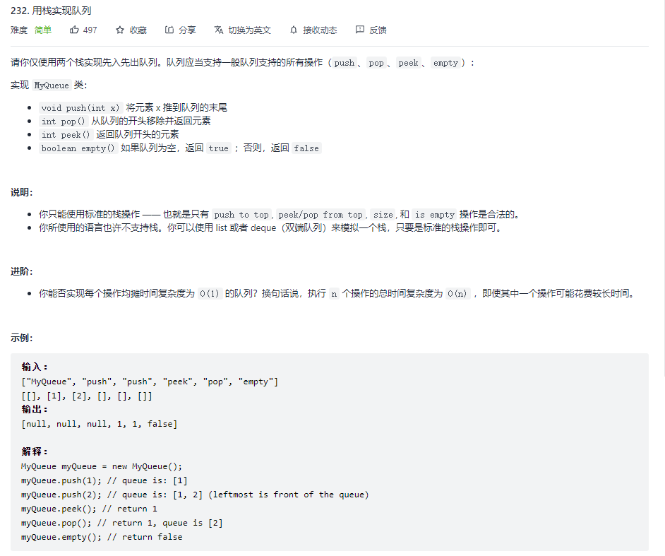
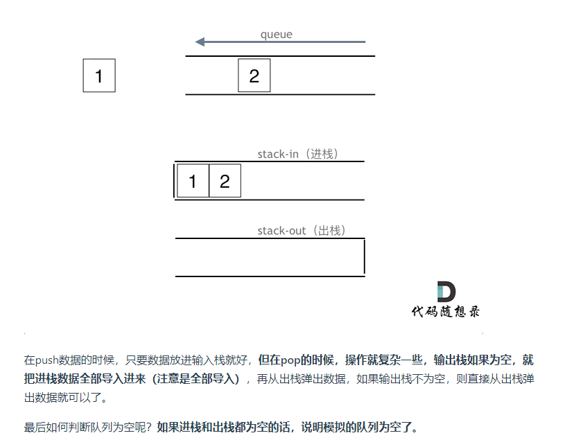

### 用栈实现队列
```javascript
// 使用两个数组的栈方法（push, pop） 实现队列
/**
* Initialize your data structure here.
*/
var MyQueue = function () {
    this.stack1 = [];
    this.stack2 = [];
};

/**
* Push element x to the back of queue. 
* @param {number} x
* @return {void}
*/
MyQueue.prototype.push = function (x) {
    this.stack1.push(x);
};

/**
* Removes the element from in front of queue and returns that element.
* @return {number}
*/
MyQueue.prototype.pop = function () {
    const size = this.stack2.length;
    if (size) {
        return this.stack2.pop();
    }
    while (this.stack1.length) {
        this.stack2.push(this.stack1.pop());
    }
    return this.stack2.pop();
};

/**
* Get the front element.
* @return {number}
*/
MyQueue.prototype.peek = function () {
    const x = this.pop();
    this.stack2.push(x);
    return x;
};

/**
* Returns whether the queue is empty.
* @return {boolean}
*/
MyQueue.prototype.empty = function () {
    return !this.stack1.length && !this.stack2.length
};
```


### 用队列实现栈
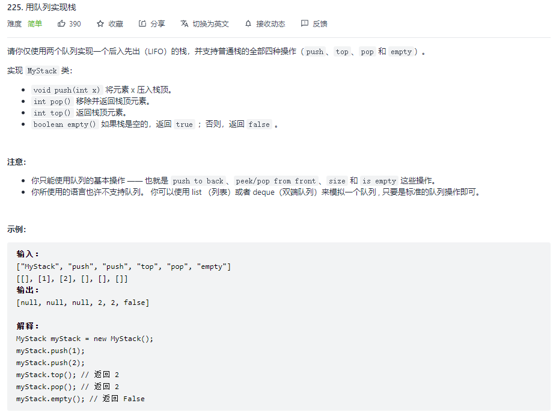
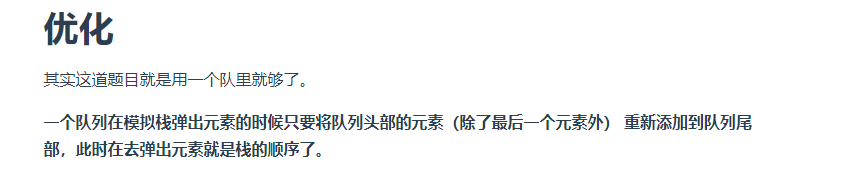
```javascript
// 使用一个队列实现
/**
 * Initialize your data structure here.
 */
var MyStack = function() {
    this.queue = [];
};

/**
 * Push element x onto stack. 
 * @param {number} x
 * @return {void}
 */
MyStack.prototype.push = function(x) {
    this.queue.push(x);
};

/**
 * Removes the element on top of the stack and returns that element.
 * @return {number}
 */
MyStack.prototype.pop = function() {
    let size = this.queue.length;
    while(size-- > 1) {
        this.queue.push(this.queue.shift());
    }
    return this.queue.shift();
};

/**
 * Get the top element.
 * @return {number}
 */
MyStack.prototype.top = function() {
    const x = this.pop();
    this.queue.push(x);
    return x;
};

/**
 * Returns whether the stack is empty.
 * @return {boolean}
 */
MyStack.prototype.empty = function() {
    return !this.queue.length;
};
```


### 有效的括号
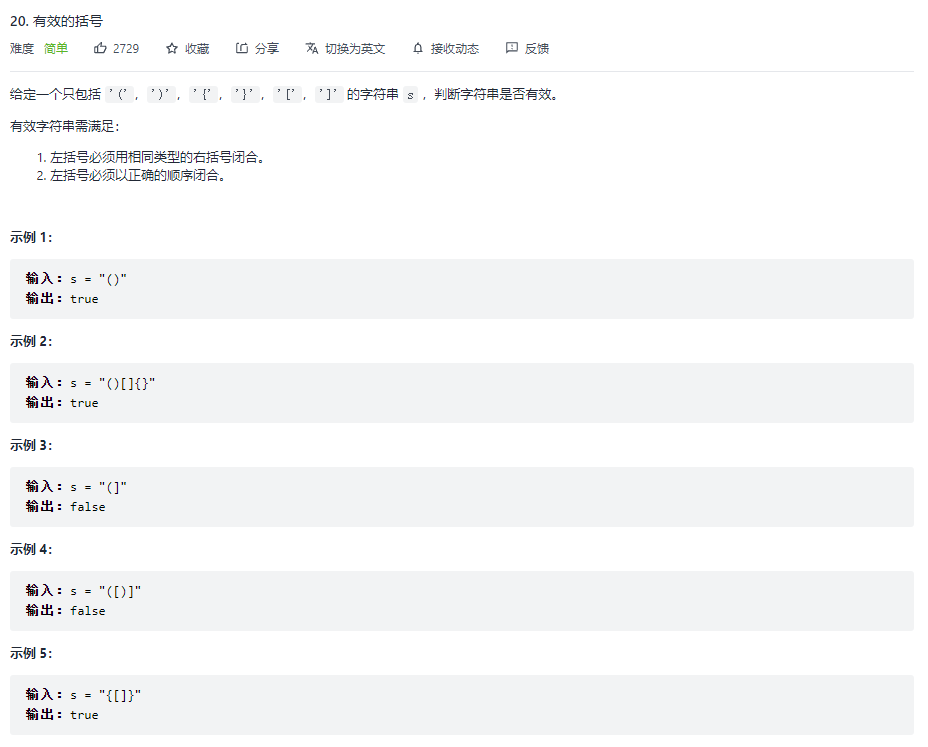
```javascript
/**
 * @param {string} s
 * @return {boolean}
 */
const isValid = function (string) {
	let n = string.length;
	if (n % 2) {
		return false;
	}
	// 左边入栈 右边出栈
	let pairs = new Map([
		[')', '('],
		[']', '['],
		['}', '{']
	])


	let stack = [];
	for (const str of string) {
		// 出栈
		if (pairs.has(str)) {
			if (!stack.length || stack[stack.length - 1] !== pairs.get(str)) {
				return false;
			}
			stack.pop()
		} else {
			// 入栈
			stack.push(str)
		}

	}

	// return stack.length ? false : true
	return !stack.length

};
```


### 删除字符串中的所有相邻重复项
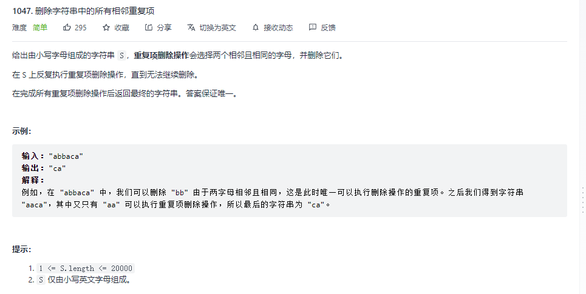

```javascript
const removeDuplicates = function (S) {
	let stack = [];
	for (const str of S) {
		// stack 为空 直接入栈
		// console.log(stack)
		if (!stack.length) {
			stack.push(str)
		} else {
			if (stack[stack.length - 1] == str) {
				stack.pop()
			} else {
				stack.push(str)
			}
		}
	}
	return stack.join('')
};
```


###  逆波兰表达式求值
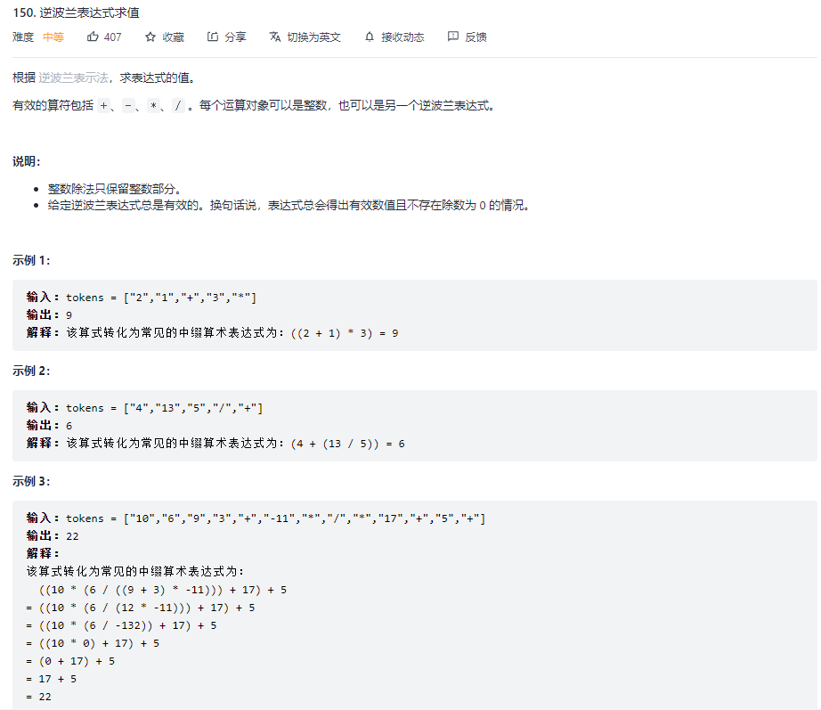
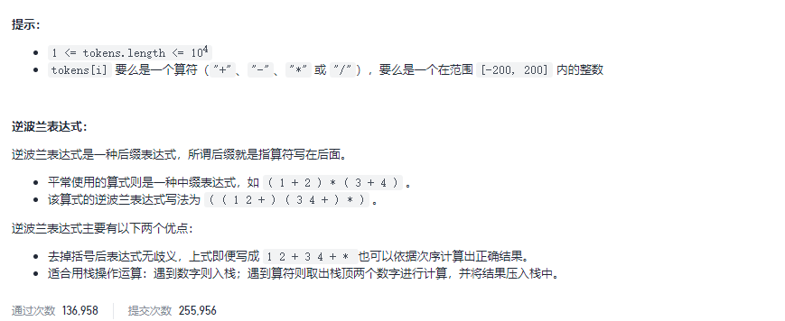
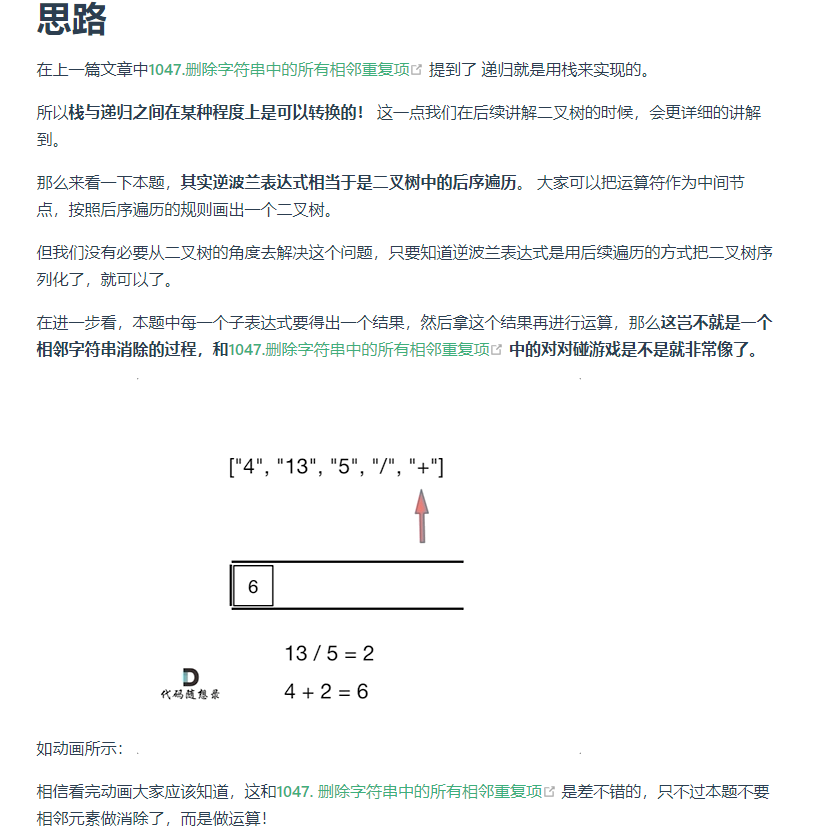
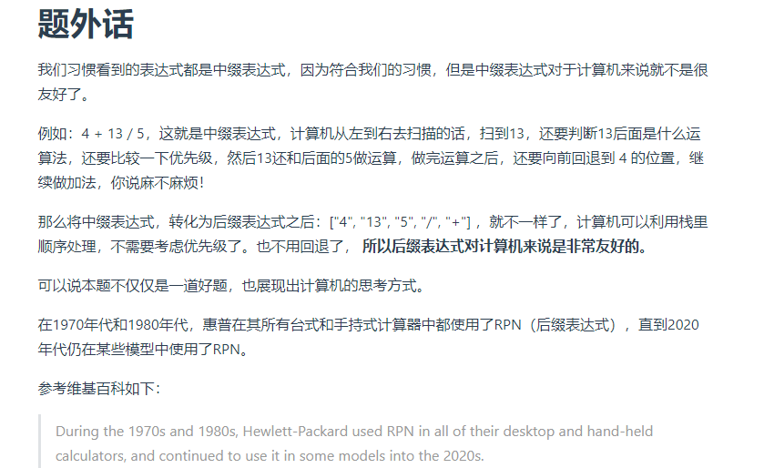
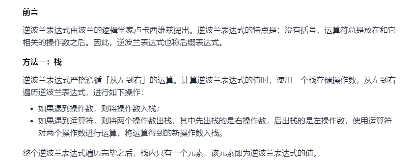

```javascript
/**
 * @param {string[]} tokens
 * @return {number}
 */
var evalRPN = function(tokens) {
    const s = new Map([
        ["+", (a, b) => a * 1  + b * 1],
        ["-", (a, b) => b - a],
        ["*", (a, b) => b * a],
        ["/", (a, b) => (b / a) | 0]
    ]);
    const stack = [];
    for (const i of tokens) {
        if(!s.has(i)) {
            stack.push(i);
            continue;
        }
        stack.push(s.get(i)(stack.pop(),stack.pop()))
    }
    return stack.pop();
};
```


### 滑动窗口最大值
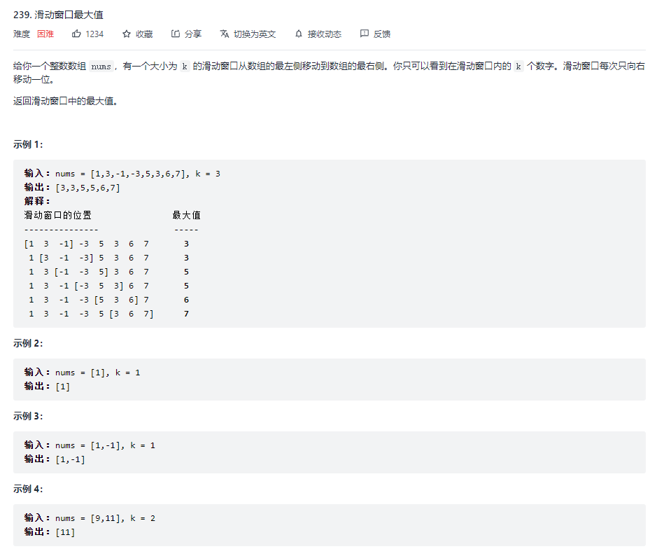
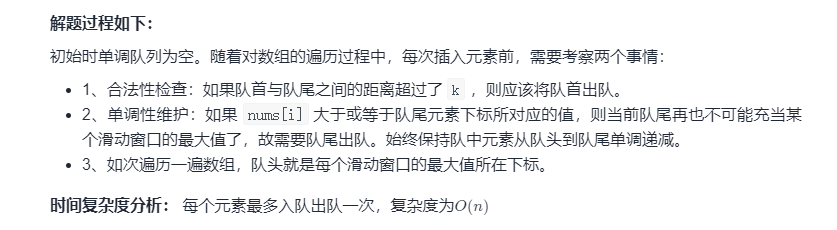

```javascript
var maxSlidingWindow = function (nums, k) {
  const n = nums.length;
  const q = [];
  // 滑动框未填充满时
  for (let i = 0; i < k; i++) {
    // 当前元素大于队尾元素
    while (q.length && nums[i] >= nums[q[q.length - 1]]) {
      q.pop();
    }
    // 保存索引
    q.push(i);
  }

  const ans = [nums[q[0]]];
  for (let i = k; i < n; i++) {
    // 当前元素大于队尾元素
    while (q.length && nums[i] >= nums[q[q.length - 1]]) {
      q.pop();
    }
    q.push(i);
    // 队首元素不在滑动框中
    while (q[0] <= i - k) {
      q.shift();
    }
    ans.push(nums[q[0]]);
  }
  return ans;
};
```


### 前 K 个高频元素
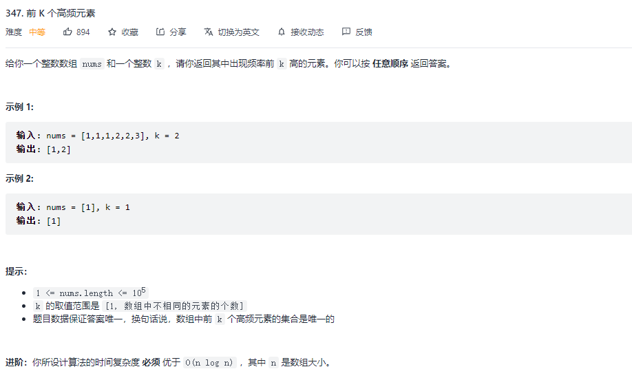
```javascript
let topKFrequent = function (nums, k) {
        let map = new Map()
        nums.map(num => {
          map.set(num, map.has(num) ? map.get(num) + 1 : 1)
        })

        return [...map.entries()]
          .sort((a, b) => b[1] - a[1])
          .slice(0, k)
          .map(item => item[0])
      }
```
```javascript
class MinHeap{
    constructor() {
        this.heap = [];
    }
    getParentIndex(i){
      return (i - 1) >> 1; // 相对于除以2 取整
    }
    getLeftIndex(i){
        return  i * 2 + 1
    }
    getRightIndex(i){
        return i * 2 + 2
    }
    swap(i1, i2){
        [this.heap[i1], this.heap[i2]] = [this.heap[i2], this.heap[i1]]
    }
    shiftUp(index){
        if(index == 0)  return; // 到堆顶了
        const parentIndex = this.getParentIndex(index);
        if(this.heap[parentIndex] && this.heap[parentIndex].value > this.heap[index].value){
            this.swap(parentIndex, index)
            this.shiftUp(parentIndex);
        }
    }
    shiftDown(index){
        const leftIndex = this.getLeftIndex(index);
        const rightIndex = this.getRightIndex(index);
        if(this.heap[leftIndex] && this.heap[leftIndex].value < this.heap[index].value){
            this.swap(leftIndex, index);
            this.shiftDown(leftIndex);
        }
        if(this.heap[rightIndex] && this.heap[rightIndex].value < this.heap[index].value){
            this.swap(rightIndex, index);
            this.shiftDown(rightIndex);
        }
    }
    // 插入
    insert(value){
        this.heap.push(value);
        this.shiftUp(this.heap.length - 1);
    }
    pop(){
        this.heap[0] = this.heap.pop();
        this.shiftDown(0);
    }
    peek(){
        return this.heap[0];
    }
    size(){
        return this.heap.length;
    }
}


/**
 * @param {number[]} nums
 * @param {number} k
 * @return {number[]}
 */
var topKFrequent = function(nums, k) {
    const map = new Map();
    nums.forEach(num =>{
        map.set(num, map.has(num) ? map.get(num) + 1 : 1);
    })
    const h = new MinHeap();
    map.forEach((value, key) => {
        h.insert({value, key});
        if(h.size() > k){
            h.pop();
        }
    })
    return h.heap.map(a => a.key);

};
```